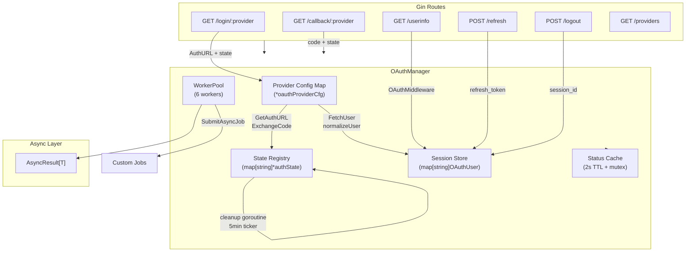
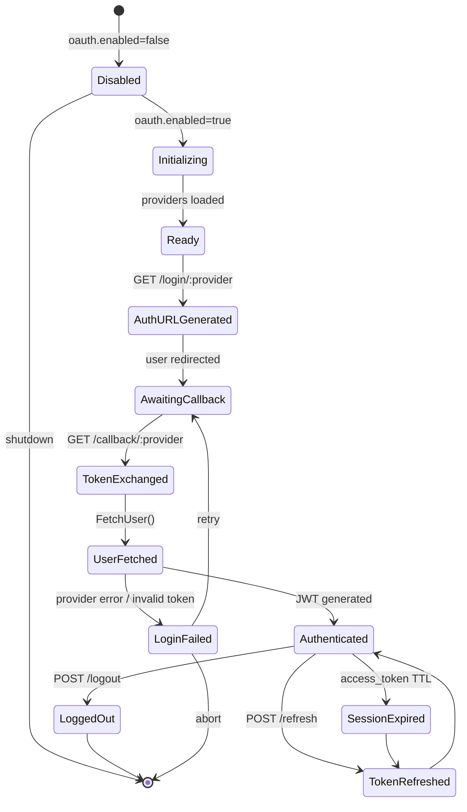

# OAuth Manager

## Overview

The `OAuthManager` is a comprehensive Go library for OAuth 2.0 authentication using the standard `golang.org/x/oauth2` package. It provides multi-provider and multi-tenant support, PKCE-based authorization code flow, built-in provider endpoints for 8 major identity providers (Google, GitHub, Facebook, Apple, Microsoft, Twitter, GitLab, and custom OIDC), JWT session management, Gin middleware for route protection, full REST API endpoints for the OAuth flow, async wrappers, worker pool concurrency, and production-grade status/health reporting — all as a self-contained plugin that requires zero changes to the central configuration structs.

**Import Path:** `stackyrd/pkg/infrastructure`

**Library:** `golang.org/x/oauth2` (standard OAuth2 client)

**JWT Library:** `github.com/golang-jwt/jwt/v5`

## Features

- **8 Built-In Providers**: Pre-configured endpoints for Google, GitHub, Facebook, Apple, Microsoft, Twitter, GitLab
- **Custom OIDC Support**: Any OpenID Connect provider via configurable auth/token/userinfo URLs
- **Multi-Provider & Multi-Tenant**: Multiple provider and tenant configurations in a single instance
- **PKCE Authorization Code Flow**: S256 code challenge + verifier for secure OAuth2 exchange
- **State Parameter CSRF Protection**: Cryptographically random state tokens with automatic cleanup
- **JWT Session Management**: Access + refresh token issuance with configurable expiry and HMAC signing
- **Gin Middleware**: `OAuthMiddleware()` for protecting any route with Bearer token validation
- **REST API Endpoints**: Login, callback, userinfo, refresh, logout, providers list (all via Gin)
- **Provider-Specific User Normalization**: Maps raw provider responses to a standard `OAuthUser` struct
- **Cookie-Based State**: Optional cookie storage for state parameter across redirects
- **Complete Async Support**: Every major operation has an `*Async` counterpart returning `*AsyncResult[T]`
- **Worker Pool**: 6-worker pool for async jobs + `SubmitAsyncJob`
- **Status & Health**: TTL-cached `GetStatus()` with provider count, active sessions, JWT config
- **In-Memory Session Store**: Active session tracking with ID-based invalidation
- **Plugin Architecture**: 100% self-contained — configuration read exclusively via Viper, registered via `init()`
- **Graceful Disable**: Returns `nil, nil` when `oauth.enabled=false`

## Quick Start

```go
package main

import (
	"context"
	"fmt"
	"stackyrd/pkg/infrastructure"
	"stackyrd/pkg/logger"
)

func main() {
	log := logger.NewLogger()

	// Create OAuth manager (configuration via viper under "oauth")
	manager, err := infrastructure.NewOAuthManager(log)
	if err != nil {
		panic(err)
	}
	if manager == nil {
		fmt.Println("OAuth disabled in config")
		return
	}
	defer manager.Close()

	ctx := context.Background()

	// Get auth URL for Google provider
	authURL, state, err := manager.GetAuthURL("google", "", "/dashboard")
	if err != nil {
		panic(err)
	}
	fmt.Printf("Auth URL: %s\n", authURL)
	fmt.Printf("State: %s\n", state)

	// Exchange code for user (in a real callback handler)
	// user, accessToken, refreshToken, err := manager.SignIn(ctx, "google", code, state)
}
```

## Architecture

### Core Structs

| Struct                      | Description                                            |
|-----------------------------|--------------------------------------------------------|
| `OAuthManager`              | Main manager — provider configs, session store, state registry, worker pool |
| `OAuthUser`                 | Normalized user profile from any provider              |
| `authState` (internal)      | PKCE code verifier + state with TTL expiry             |
| `OAuthClaims`               | JWT claims embedding `OAuthUser` + session ID + tenant |
| `oauthConfig` (internal)    | Self-contained config shape (providers, session, token, routes, tenants) |

### Concurrency Model



### State Diagram



## How It Works

### 1. Initialization Flow

```
NewOAuthManager(l)
    │
    ├── viper.GetBool("oauth.enabled") → false → return nil, nil
    ├── viper.UnmarshalKey("oauth", &oauthConfig)
    ├── fill defaults from newDefaultOAuthConfig()
    ├── for each provider in cfg.Providers:
    │     ├── look up in builtInProviders map
    │     ├── if known: fill default AuthURL, TokenURL, UserInfoURL, Scopes
    │     ├── if unknown: validate required fields (Name, ClientID, ClientSecret)
    │     └── store in providers[name]
    ├── NewWorkerPool(6).Start()
    ├── startStateCleanup() → goroutine with 5min ticker
    └── Return OAuthManager{providers, sessions, states, pool, ...}
```

### 2. Authorization Code Flow (PKCE)

```
GET /login/:provider
    │
    ├── GetOAuthConfig(provider) → *oauth2.Config
    ├── generateState() → 32-byte hex
    ├── generateCodeVerifier() → 32-byte base64url
    ├── generateCodeChallenge(verifier) → SHA256 → base64url
    ├── store authState{state, codeVerifier, provider, ExpiresAt}
    └── return oauth2.Config.AuthCodeURL(state, code_challenge=S256)
```

### 3. Token Exchange Flow

```
GET /callback/:provider?code=X&state=Y
    │
    ├── lookup state in states registry
    ├── delete state (single-use)
    ├── validate provider matches
    ├── cfg.Exchange(ctx, code, code_verifier)
    │     └── POST to tokenURL with code + verifier
    ├── return *oauth2.Token{AccessToken, RefreshToken, Expiry}
    └── on success → FetchUser()
```

### 4. User Fetch and Normalization

```
FetchUser(ctx, "google", oauth2Token)
    │
    ├── GET userInfoURL with Bearer token
    ├── parse JSON → map[string]interface{}
    ├── normalizeUser(provider, rawData)
    │     └── switch on provider:
    │           Google → data["id"], data["email"], data["name"], data["picture"]
    │           GitHub → data["id"], data["name"], data["email"], data["avatar_url"]
    │           Facebook → data["id"], data["name"], data["picture.data.url"]
    │           Apple → data["sub"], data["email"]
    │           ... etc for Microsoft, Twitter, GitLab
    │           custom → data["sub"], data["email"], data["name"]
    └── Return *OAuthUser{Provider, ProviderID, Email, Name, AvatarURL, ...}
```

### 5. JWT Generation

```
GenerateJWT(user)
    │
    ├── uuid.New() → sessionID
    ├── build OAuthClaims{
    │     User, SessionID, Tenant,
    │     RegisteredClaims{ExpiresAt, IssuedAt, Issuer, Subject, ID}
    │   }
    ├── jwt.NewWithClaims(HS256, accessClaims).SignedString(secret)
    ├── build refreshClaims with longer expiry
    ├── jwt.NewWithClaims(HS256, refreshClaims).SignedString(secret)
    ├── store user in sessions[sessionID]
    └── return accessToken, refreshToken
```

### 6. Status Caching Flow

```
GetStatus()
    │
    ├── statusMu + check 2s TTL cache → return cached
    ├── count providers → provider_count, providers[]
    ├── count active sessions → active_sessions
    ├── count pending states → pending_states
    ├── check JWT secret → jwt_configured
    ├── store in cache + update expiry
    └── return fresh stats
```

## Configuration

### Viper Configuration Options (plugin style — no central struct)

| Key                               | Type   | Default                          | Description                                    |
|-----------------------------------|--------|----------------------------------|------------------------------------------------|
| `oauth.enabled`                   | bool   | false                            | Enable/disable the OAuth plugin                |
| `oauth.default_scope`             | array  | ["openid","profile","email"]     | Default scopes for all providers               |
| `oauth.providers`                 | array  | []                               | Provider configurations (see below)            |
| `oauth.providers[].name`          | string | ""                               | Provider identifier (google, github, etc.)     |
| `oauth.providers[].enabled`       | bool   | false                            | Enable this provider                           |
| `oauth.providers[].client_id`     | string | ""                               | OAuth client ID                                |
| `oauth.providers[].client_secret` | string | ""                               | OAuth client secret                            |
| `oauth.providers[].redirect_url`  | string | ""                               | OAuth redirect URI                             |
| `oauth.providers[].scopes`        | array  | provider default / default_scope | OAuth scopes                                   |
| `oauth.providers[].auth_url`      | string | built-in                         | Custom auth URL (overrides built-in)           |
| `oauth.providers[].token_url`     | string | built-in                         | Custom token URL (overrides built-in)          |
| `oauth.providers[].userinfo_url`  | string | built-in                         | Custom userinfo URL (overrides built-in)       |
| `oauth.session.secret`            | string | ""                               | Session cookie secret (optional)               |
| `oauth.session.expiry`            | duration| 15m                             | State parameter TTL                            |
| `oauth.session.cookie`            | bool   | false                            | Store state in cookie instead of response body |
| `oauth.session.cookie_domain`     | string | ""                               | Cookie domain                                  |
| `oauth.session.secure`            | bool   | true                             | Set Secure flag on cookies                     |
| `oauth.token.jwt_secret`          | string | ""                               | HMAC-SHA256 secret for JWT signing             |
| `oauth.token.access_expiry`       | duration| 1h                              | Access token TTL                               |
| `oauth.token.refresh_expiry`      | duration| 720h (30d)                      | Refresh token TTL                              |
| `oauth.token.issuer`              | string | "stackyrd-oauth"                 | JWT issuer claim                               |
| `oauth.routes.base_path`          | string | "/api/v1/auth/oauth"             | Base path for all OAuth routes                 |
| `oauth.routes.login_path`         | string | "/login"                         | Login endpoint path (appended to base_path)    |
| `oauth.routes.callback_path`      | string | "/callback"                      | Callback endpoint path                         |
| `oauth.routes.userinfo_path`      | string | "/userinfo"                      | User info endpoint path                        |
| `oauth.routes.refresh_path`       | string | "/refresh"                       | Token refresh endpoint path                    |
| `oauth.routes.logout_path`        | string | "/logout"                        | Logout endpoint path                           |
| `oauth.routes.providers_path`     | string | "/providers"                     | Providers list endpoint path                   |
| `oauth.tenants`                   | array  | []                               | Multi-tenant configurations (each has name, enabled, providers[]) |

**Environment variable mapping** (automatic via Viper):
- `OAUTH_ENABLED=true`
- `OAUTH_PROVIDERS_0_NAME=google`
- `OAUTH_PROVIDERS_0_CLIENT_ID=xxx.apps.googleusercontent.com`
- `OAUTH_PROVIDERS_0_CLIENT_SECRET=GOCSPX-...`
- `OAUTH_PROVIDERS_0_REDIRECT_URL=https://example.com/api/v1/auth/oauth/callback/google`
- `OAUTH_TOKEN_JWT_SECRET=your-256-bit-secret`
- `OAUTH_TOKEN_ACCESS_EXPIRY=2h`
- `OAUTH_ROUTES_BASE_PATH=/api/v1/auth/oauth`

### Example YAML (single tenant, multiple providers)

```yaml
oauth:
  enabled: true
  default_scope:
    - openid
    - profile
    - email
  providers:
    - name: google
      enabled: true
      client_id: "xxx.apps.googleusercontent.com"
      client_secret: "GOCSPX-..."
      redirect_url: "https://example.com/api/v1/auth/oauth/callback/google"
    - name: github
      enabled: true
      client_id: "Ov23li..."
      client_secret: "xxxxxxxxxxxxxxxxxxxxxxxxxxxxxxxx"
      redirect_url: "https://example.com/api/v1/auth/oauth/callback/github"
    - name: custom
      enabled: true
      client_id: "my-client-id"
      client_secret: "my-client-secret"
      redirect_url: "https://example.com/api/v1/auth/oauth/callback/custom"
      auth_url: "https://auth.example.com/oauth2/authorize"
      token_url: "https://auth.example.com/oauth2/token"
      userinfo_url: "https://auth.example.com/oauth2/userinfo"
      scopes:
        - openid
        - profile
  session:
    expiry: 15m
    cookie: true
    secure: true
  token:
    jwt_secret: "your-256-bit-secret-must-be-at-least-32-chars"
    access_expiry: 1h
    refresh_expiry: 720h
    issuer: "my-app"
```

### Example YAML (multi-tenant)

```yaml
oauth:
  enabled: true
  token:
    jwt_secret: "your-256-bit-secret"
  tenants:
    - name: tenant-a
      enabled: true
      providers:
        - name: google
          enabled: true
          client_id: "..."
          client_secret: "..."
          redirect_url: "https://tenant-a.example.com/oauth/callback/google"
    - name: tenant-b
      enabled: true
      providers:
        - name: github
          enabled: true
          client_id: "..."
          client_secret: "..."
          redirect_url: "https://tenant-b.example.com/oauth/callback/github"
```

## Usage Examples

### Full OAuth Login Flow (via Gin routes)

```go
// Register OAuth routes on your Gin engine
oauthManager, _ := infrastructure.NewOAuthManager(log)
router := gin.Default()
oauthManager.RegisterRoutes(&router.RouterGroup)

// User visits: GET /api/v1/auth/oauth/login/google
// → receives auth_url, redirects to Google
// Google redirects to: GET /api/v1/auth/oauth/callback/google?code=X&state=Y
// → receives user object + access_token + refresh_token
```

### Protecting Routes with OAuth Middleware

```go
router.GET("/api/protected", oauthManager.OAuthMiddleware(), func(c *gin.Context) {
    user := c.MustGet("oauth_user").(infrastructure.OAuthUser)
    sessionID := c.MustGet("oauth_session_id").(string)
    c.JSON(200, gin.H{
        "user":       user,
        "session_id": sessionID,
    })
})
```

### Manual Login (no Gin routes)

```go
ctx := context.Background()

// Step 1: Get authorization URL
authURL, state, err := manager.GetAuthURL("google", "", "/dashboard")
// redirect user to authURL...

// Step 2: Exchange code for tokens (in callback handler)
user, accessToken, refreshToken, err := manager.SignIn(ctx, "google", code, state)
```

### Authenticate (without local JWT)

```go
user, err := manager.Authenticate(ctx, "google", code, state)
fmt.Printf("Authenticated: %s (%s)\n", user.Name, user.Email)
```

### Token Refresh

```go
newAccess, newRefresh, err := manager.RefreshAccessToken(refreshToken)
if err != nil {
    // refresh token expired — user must re-authenticate
}
```

### Session Management

```go
// Invalidate session (logout)
manager.InvalidateSession(sessionID)

// Lookup session by ID
user, exists := manager.GetUserBySession(sessionID)
```

### List Available Providers

```go
providers := manager.GetProviders()
for _, p := range providers {
    fmt.Printf("%s: %s\n", p["name"], p["display_name"])
}
```

### Async Operations

```go
result := manager.SignInAsync(ctx, "google", code, state)
select {
case <-result.Done:
    val, err := result.Wait()
    if err == nil {
        fmt.Println("User:", val.User.Name)
        fmt.Println("Token:", val.AccessToken)
    }
case <-time.After(30 * time.Second):
    fmt.Println("OAuth sign-in timed out")
}
```

### Fetch User Async

```go
result := manager.FetchUserAsync(ctx, "google", oauth2Token)
user, err := result.WaitWithTimeout(10 * time.Second)
```

### Refresh Token Async

```go
result := manager.RefreshAccessTokenAsync(refreshToken)
tokens, err := result.Wait()
```

### Submit Custom Async Job

```go
manager.SubmitAsyncJob(func() {
    // long running work (e.g., batch token refresh)
    for _, sessionID := range sessionIDs {
        manager.InvalidateSession(sessionID)
    }
})
```

### Status & Health

```go
status := manager.GetStatus()
fmt.Println("Connected:", status["connected"])
fmt.Println("Providers:", status["providers"])
fmt.Println("Active sessions:", status["active_sessions"])
fmt.Println("JWT configured:", status["jwt_configured"])
```

## Error Handling

All methods follow standard Go error patterns. `GetStatus()` returns `connected=false` on nil receiver or when no providers are configured.

Common errors:
- `unknown OAuth provider: <name>`
- `invalid or expired state parameter`
- `state provider mismatch: expected <x>, got <y>`
- `token exchange failed for <provider>: <underlying_error>`
- `failed to fetch user info from <provider>: status <code>, body: <body>`
- `JWT secret not configured`
- `unexpected signing method: <alg>`
- `invalid token: <underlying_error>`
- `session not found for refresh token`
- `missing authorization code`
- `missing state parameter`

## Common Pitfalls

### 1. Redirect URI Mismatch
OAuth providers require an **exact match** between the registered redirect URI and the one in config. Trailing slashes, protocol mismatches (`http://` vs `https://`), and port differences all cause `redirect_uri_mismatch` errors.

**Solution:** Copy the redirect URI directly from your provider dashboard into `oauth.providers[].redirect_url`.

### 2. JWT Secret Not Set or Too Short
The plugin requires `oauth.token.jwt_secret` to issue access and refresh tokens. HMAC-SHA256 secrets should be at least 32 bytes (256 bits).

**Solution:** Generate a strong secret: `openssl rand -hex 32`. Set it in config or via env `OAUTH_TOKEN_JWT_SECRET`.

### 3. State Expiry / Cookie Not Shared
The auth state parameter has a default TTL of 15 minutes. If your OAuth flow takes longer (e.g., user is on a mobile device), the state expires and the callback fails.

**Solution:** Increase `oauth.session.expiry`, or ensure state is stored server-side and lookup is by the state value in the callback. When using cookies, ensure `oauth.session.cookie_domain` matches your domain and `secure` is appropriate for your environment (disable for local dev with HTTP).

### 4. Custom OIDC Provider Missing Endpoints
When using a custom OIDC provider, all three of `auth_url`, `token_url`, and `userinfo_url` must be configured. Missing any causes silent failures at different stages of the flow.

**Solution:** Configure all three URLs for custom providers. If your provider supports OpenID Connect Discovery, you can fetch these from `/.well-known/openid-configuration`.

### 5. Scope Mismatch
The plugin's default scopes include `openid`, `profile`, and `email`. Some providers (e.g., Twitter/X) use different scope names and may fail silently if the requested scopes are not recognized.

**Solution:** Override `scopes` per provider with the exact scope strings required by that provider's documentation.

### 6. Multi-Tenant Routing
The `tenants` config array registers provider configurations but route handling does not automatically namespace by tenant — callers must pass the `tenant` query parameter to `GetAuthURL` and it is embedded in the state for the callback.

**Solution:** When using tenants, ensure your frontend passes `?tenant=tenant-a` to the login endpoint. The tenant is included in the generated JWT claims and available as `oauth_tenant` in middleware context.

## Advanced Usage

### Using OAuthMiddleware with Role-Based Access

```go
router.GET("/api/admin", oauthManager.OAuthMiddleware(), func(c *gin.Context) {
    user := c.MustGet("oauth_user").(infrastructure.OAuthUser)
    tenant := c.GetString("oauth_tenant")
    provider := c.GetString("oauth_provider")

    // Custom authorization logic
    if user.Email != "admin@example.com" {
        c.JSON(403, gin.H{"error": "forbidden"})
        c.Abort()
        return
    }
    c.JSON(200, gin.H{"user": user, "tenant": tenant, "provider": provider})
})
```

### Custom Gin Route Registration (non-default paths)

```go
// Override the base path
viper.Set("oauth.routes.base_path", "/auth")
// Then RegisterRoutes mounts under /auth
oauthManager.RegisterRoutes(&router.RouterGroup)
// Results in: /auth/login/google, /auth/callback/google, etc.
```

### Manual OAuth2 Config Access

```go
cfg, err := oauthManager.GetOAuthConfig("google")
// cfg is *oauth2.Config — use directly with golang.org/x/oauth2
token, err := cfg.Exchange(ctx, code)
client := cfg.Client(ctx, token)
```

### State Cookie for Server-Side Sessions

```go
// Enable cookie-based state in config:
// oauth:
//   session:
//     cookie: true
//     cookie_domain: ".example.com"
//     secure: true

// The state is automatically set as an HTTP-only cookie
// on /login and cleared on successful /callback
```

## Internal Algorithms

(See "How It Works" section above for the numbered flows covering initialization, authorization code flow with PKCE, token exchange, user fetch and normalization, JWT generation, and status caching.)

## Dependencies

| Dependency                          | Role                                    |
|-------------------------------------|-----------------------------------------|
| `golang.org/x/oauth2`               | OAuth2 client (auth code flow, token exchange) |
| `github.com/golang-jwt/jwt/v5`     | JWT access + refresh token signing      |
| `github.com/google/uuid`            | Session ID generation                   |
| `github.com/gin-gonic/gin`          | HTTP routing and middleware             |
| `github.com/spf13/viper`            | Configuration (plugin style)            |
| `stackyrd/pkg/logger`               | Structured logging                      |
| `stackyrd/pkg/infrastructure` (internal) | WorkerPool, AsyncResult, registry |
| Standard library                    | `crypto/rand`, `crypto/sha256`, `net/http`, `context`, `sync`, `time`, `encoding/json` |

## License

This code is part of the Stackyrd project. See the main project LICENSE file for details.
