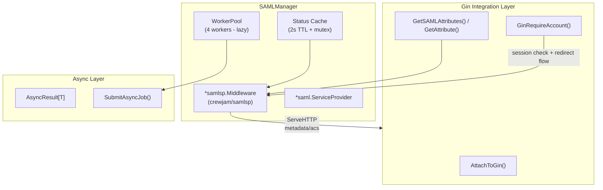

# SAML SSO Manager

## Overview

The `SAMLManager` is a comprehensive, production-ready SAML 2.0 SSO (Service Provider) integration component built on the battle-tested `github.com/crewjam/saml` library and its `samlsp` helper package. It enables enterprise single sign-on against any SAML 2.0 compliant Identity Provider (IdP) such as Okta, Azure AD/Entra ID, Google Workspace, Keycloak, Auth0, Ping, OneLogin, etc.

It provides a rich, Gin-native API with zero-config boilerplate for the common flows, automatic session management via signed JWT cookies, attribute extraction, metadata generation, async helpers, and full observability — delivered as a self-contained plugin-style infrastructure component. Zero changes required to central config structs.

**Import Path:** `stackyrd/pkg/infrastructure`

**Library:** `github.com/crewjam/saml` (v0.5.1) + `github.com/crewjam/saml/samlsp` (SP middleware, WebSSO profile, HTTP-POST/Redirect bindings, signed/encrypted assertions)

## Features

- **Full SAML 2.0 SP Support**: Web SSO profile, HTTP-Redirect & HTTP-POST bindings, signed requests, signed/encrypted responses
- **Rich Gin Integration**: `AttachToGin()`, `GinRequireAccount()`, `GetSAMLAttributes()`, `GetAttribute()`, seamless with existing Gin routers and JWT middleware
- **Zero-Config Endpoints**: Automatic handling of `/saml/metadata` (GET) and `/saml/acs` (POST) — the only two endpoints required for fully working SSO
- **Flexible IdP Metadata**: Fetch from URL at startup or supply raw XML / file path
- **SP Certificate Management**: Load X.509 key/cert from filesystem (standard PEM)
- **IdP-Initiated Login Support**: Optional `allow_idp_initiated`
- **Session & Attributes**: Automatic JWT-based session cookies, easy extraction of assertion attributes (groups, email, roles, etc.)
- **Advanced Helpers**: `GetMetadataXML()`, `GetServiceProvider()` for low-level access, `FetchIDPMetadataAsync()`, `SubmitAsyncJob()`
- **Error Handling & Logging**: Integrated with stackyrd structured logger + custom `OnError`
- **Health & Observability**: TTL-cached `GetStatus()` with entity IDs, ACS URL, IdP info — visible in `/health` and TUI dashboard
- **Plugin Architecture**: 100% self-contained, Viper-only config, `init()` auto-registration, graceful disable
- **Optional Async**: Worker pool for background jobs (SLO, attribute sync, etc.)
- **Security Best Practices**: Request signing enabled by default, proper RelayState handling via cookies

## Quick Start

```go
package main

import (
	"fmt"
	"stackyrd/pkg/infrastructure"
	"stackyrd/pkg/logger"

	"github.com/gin-gonic/gin"
)

func main() {
	log := logger.NewLogger()

	// Create SAML manager (config read via Viper under "saml" key only)
	samlMgr, err := infrastructure.NewSAMLManager(log)
	if err != nil {
		panic(err)
	}
	if samlMgr == nil {
		fmt.Println("SAML SSO disabled in config")
		return
	}
	defer samlMgr.Close()

	r := gin.Default()

	// 1. Mount the SAML protocol endpoints (metadata + ACS)
	samlMgr.AttachToGin(r)

	// 2. Protect routes — unauthenticated users are auto-redirected to IdP
	r.GET("/dashboard", samlMgr.GinRequireAccount(), func(c *gin.Context) {
		attrs := samlMgr.GetSAMLAttributes(c)
		email := samlMgr.GetAttribute(c, "email")
		fmt.Fprintf(c.Writer, "Hello %s! Groups: %+v\n", email, attrs["groups"])
	})

	// Optional: expose metadata for initial IdP registration
	r.GET("/saml-debug/metadata", func(c *gin.Context) {
		xml, _ := samlMgr.GetMetadataXML()
		c.Data(200, "application/samlmetadata+xml", xml)
	})

	r.Run(":8080")
}
```

## Architecture

### Core Structs

| Struct                  | Description                                                                 |
|-------------------------|-----------------------------------------------------------------------------|
| `SAMLManager`           | Main component holding `*samlsp.Middleware`, `*saml.ServiceProvider`, pool  |
| `samlConfig` (local)    | Internal Viper-unmarshaled configuration (never exported to central config) |
| `samlsp.Middleware`     | From crewjam/saml — handles ACS, metadata, RequireAccount, sessions         |
| `saml.ServiceProvider`  | Core SP object (metadata, MakeAuthenticationRequest, ParseResponse, etc.)   |

### Concurrency Model



## How It Works

### 1. Initialization Flow

```
NewSAMLManager(l)
    │
    ├── viper.UnmarshalKey("saml", &samlConfig)  [or direct Get* fallback]
    ├── !cfg.Enabled → return nil, nil
    ├── Load X.509 keypair (tls.LoadX509KeyPair + ParseCertificate)
    ├── Load IdP metadata:
    │     ├── if idp_metadata_xml (starts with <) → xml.Unmarshal
    │     ├── else if file path → os.ReadFile + unmarshal
    │     └── else → samlsp.FetchMetadata(ctx, http.DefaultClient, url)
    ├── url.Parse(root_url)
    ├── samlsp.New(Options{EntityID, URL, Key, Cert, IDPMetadata, ...})
    ├── Optional path overrides for MetadataURL / AcsURL
    ├── Wire custom OnError using stackyrd logger
    ├── Return SAMLManager{Middleware, SP, logger}
    └── ComponentRegistry registers it under name "saml"
```

### 2. Endpoint Mounting & Request Flow (Fully Working SSO)

```
Client → GET /dashboard
    │
    └── GinRequireAccount()
            ├── Session.GetSession() → has valid JWT cookie? 
            │     └── YES → inject context + attributes → protected handler
            │
            └── NO (ErrNoSession)
                    └── Middleware.HandleStartAuthFlow()
                            ├── Build AuthnRequest (signed if enabled)
                            ├── Set relay cookie (saml_*)
                            ├── HTTP-Redirect (302) or HTTP-POST (auto-submit form)
                            └── → IdP SSO endpoint

IdP → POST /saml/acs  (SAMLResponse + RelayState)
    │
    └── GinSAMLHandler() → Middleware.ServeHTTP()
            ├── ParseResponse (validate signature, timing, audience, etc.)
            ├── AssertionHandler
            ├── CreateSessionFromAssertion() → issues signed JWT session cookie
            └── Redirect to RelayState (or DefaultRedirectURI)

Subsequent request with cookie → direct access (no IdP roundtrip)
```

### 3. Metadata Registration Flow (One-time)

```
curl https://yourapp/saml/metadata > sp-metadata.xml
Upload to IdP admin console (Okta / Azure / etc.)
Configure ACS URL in IdP: https://yourapp/saml/acs
```

### 4. Status Caching Flow

```
GetStatus()
    │
    ├── statusMu + check 2s TTL → return cached
    ├── build map with connected, entity_id, acs_url, idp_entity_id, etc.
    ├── store + update expiry
    └── return
```

### 5. Async Job Submission

```
SubmitAsyncJob(func() { ... custom background work ... })
    └── startPool() once
    └── Pool.Submit(job)  (or fallback goroutine)
```

## Configuration

### Viper Configuration Options (plugin style — no central struct)

| Key                              | Type   | Default | Description |
|----------------------------------|--------|---------|-------------|
| `saml.enabled`                   | bool   | false   | Enable/disable the SAML SSO plugin |
| `saml.entity_id`                 | string | ""      | SP Entity ID (usually https://yourapp.com/saml or https://yourapp.com) |
| `saml.root_url`                  | string | ""      | Base URL of the application (must match where Gin is served, used for redirects & metadata URLs) |
| `saml.key_file`                  | string | ""      | Path to SP private key PEM (RSA 2048+ recommended) |
| `saml.cert_file`                 | string | ""      | Path to SP public certificate PEM (self-signed OK for most IdPs) |
| `saml.idp_metadata_url`          | string | ""      | URL to fetch IdP metadata XML at startup (recommended for prod) |
| `saml.idp_metadata_xml`          | string | ""      | Raw XML string **or** path to local IdP metadata XML file (either url or xml required) |
| `saml.allow_idp_initiated`       | bool   | false   | Allow unsolicited SAML responses from IdP (IdP-initiated login) |
| `saml.default_redirect_uri`      | string | "/"     | Where to send user after successful login when no RelayState present |
| `saml.metadata_path`             | string | ""      | Advanced: override metadata path (default derived as /saml/metadata) |
| `saml.acs_path`                  | string | ""      | Advanced: override ACS path (default /saml/acs) |

**Environment variable mapping** (automatic via Viper + `_` replacement):
- `SAML_ENABLED=true`
- `SAML_ENTITY_ID="https://app.example.com"`
- `SAML_ROOT_URL="https://app.example.com"`
- `SAML_KEY_FILE="/etc/certs/sp.key"`
- `SAML_CERT_FILE="/etc/certs/sp.crt"`
- `SAML_IDP_METADATA_URL="https://idp.example.com/saml/metadata"`
- `SAML_ALLOW_IDP_INITIATED=true`

### Example YAML (minimal — fully working)

```yaml
saml:
  enabled: true
  entity_id: "https://myapp.example.com/saml"
  root_url: "https://myapp.example.com"
  key_file: "certs/sp.key"
  cert_file: "certs/sp.crt"
  idp_metadata_url: "https://dev-123456.okta.com/saml/metadata"   # or Azure / Keycloak etc.
  allow_idp_initiated: true
  default_redirect_uri: "/dashboard"
```

### Example YAML (with XML file fallback)

```yaml
saml:
  enabled: true
  entity_id: "https://myapp.example.com"
  root_url: "https://myapp.example.com"
  key_file: "/run/secrets/saml-sp.key"
  cert_file: "/run/secrets/saml-sp.crt"
  idp_metadata_xml: "/etc/saml/idp-metadata.xml"   # raw XML also accepted inline
  allow_idp_initiated: false
```

## Usage Examples

### Basic Gin Integration (Recommended Pattern)

```go
samlMgr, _ := infrastructure.NewSAMLManager(log)
samlMgr.AttachToGin(r)   // wires /saml/metadata and /saml/acs automatically

r.GET("/private", samlMgr.GinRequireAccount(), func(c *gin.Context) {
    email := samlMgr.GetAttribute(c, "email")
    groups := samlMgr.GetSAMLAttributes(c)["groups"]
    // ... your logic or integrate with existing JWT claims
    c.JSON(200, gin.H{"user": email, "groups": groups})
})
```

### One-time IdP Registration (Critical for Fully Working)

```bash
# After first boot with correct config
curl -k https://localhost:8443/saml/metadata > myapp-sp-metadata.xml

# Then upload myapp-sp-metadata.xml to your IdP admin UI
# In the IdP, set the ACS (Assertion Consumer Service) URL to:
#   https://myapp.example.com/saml/acs
#   (must be HTTPS in production; most IdPs require valid cert on your SP too)
```

### Extracting Rich Attributes (Groups, Roles, Custom Claims)

```go
attrs := samlMgr.GetSAMLAttributes(c)
fmt.Println("Email:", samlMgr.GetAttribute(c, "email"))
fmt.Println("All groups:", attrs["http://schemas.microsoft.com/ws/2008/06/identity/claims/groups"])
fmt.Println("Raw assertion attributes:", attrs)
```

### Accessing the Raw ServiceProvider for Advanced Flows

```go
sp := samlMgr.GetServiceProvider()
authReq, _ := sp.MakeAuthenticationRequest(bindingLocation, saml.HTTPRedirectBinding, "")
// ... custom RelayState handling etc.
```

### Async / Background Jobs

```go
samlMgr.SubmitAsyncJob(func() {
    // e.g. background token refresh, group sync to local DB, SLO notification, etc.
    fmt.Println("Background SAML job running")
})
```

### Fetching Metadata Asynchronously (Dynamic IdP Scenarios)

```go
result := samlMgr.FetchIDPMetadataAsync("https://new-idp/metadata")
idpMeta, err := result.Wait()
```

### Status & Health (used by registry / TUI / /health)

```go
status := samlMgr.GetStatus()
fmt.Println("SAML connected:", status["connected"])
fmt.Println("SP EntityID:", status["entity_id"])
fmt.Println("ACS URL:", status["acs_url"])
```

### Generating SP Metadata Programmatically

```go
xmlBytes, _ := samlMgr.GetMetadataXML()
// serve or write to file for IdP upload
```

## Required Endpoints for Fully Working SAML 2.0 SSO

Only **two** endpoints are mandatory for a complete, standards-compliant SSO integration:

1. **GET /saml/metadata**
   - Returns the SP metadata XML document.
   - Used **once** during initial setup: download it and upload to the IdP admin console (Okta, Azure, etc.).
   - The IdP uses it to learn your EntityID, public cert, and ACS URL.

2. **POST /saml/acs**
   - The Assertion Consumer Service (ACS) endpoint.
   - The IdP POSTs the signed SAMLResponse here after the user authenticates.
   - The middleware validates the response, creates the local session cookie, and redirects the user to the original destination (or `default_redirect_uri`).

**Optional but recommended for full logout support (future SLO):**
- GET/POST /saml/slo (Single Logout) — the library wires the URL but full SLO requires additional IdP + SP coordination.

**How to wire them (one-liner):**
```go
samlMgr.AttachToGin(router)   // registers GET /saml/metadata + POST /saml/acs + any future SLO
```

No other endpoints are required from the application side. The redirect to the IdP is handled automatically inside `GinRequireAccount()`.

## Error Handling

All rich methods return standard Go errors or use the injected `OnError` handler.

Common error strings / situations:
- `saml: entity_id, root_url, key_file and cert_file are required when enabled`
- `failed to load SAML SP keypair`
- `failed to fetch IDP metadata from ...`
- `failed to parse provided IDP metadata XML`
- `SAML invalid response received` (logged with details — check clock skew, cert trust, audience)
- `saml: ...` wrapped errors from the underlying library (InvalidResponseError, etc.)

On auth failure the user receives HTTP 403 "Forbidden" (standard library behavior) after logging the error.

## Common Pitfalls

### 1. HTTPS & Production Certificates
Most IdPs require your ACS URL and metadata to be served over HTTPS with a trusted certificate. Use a reverse proxy (nginx, traefik, cloud LB) in front of the Gin app.

### 2. Clock Skew Between SP and IdP
SAML is extremely sensitive to time. Ensure both servers use NTP. The library tolerates small skew; large differences cause `InvalidResponseError`.

### 3. EntityID & ACS URL Mismatch
The EntityID and ACS URL you register in the IdP **must exactly** match what your SP metadata declares and what `root_url` + paths produce.

### 4. Self-Signed SP Cert
Perfectly acceptable and common for SAML. Just make sure you upload the correct public cert (not the key) to the IdP.

### 5. RelayState / Deep Link Loss
If you need to preserve the originally requested URL across the IdP roundtrip, just let `GinRequireAccount` do its job — it automatically uses signed cookies for RelayState (no manual work needed).

### 6. Plugin Not Appearing in Registry / TUI
- Confirm `saml.enabled: true` in the active config.yaml (or env var)
- The file must be compiled in (import of `infrastructure` package side-effect registers it)
- Check logs at boot for "SAML SSO initialized successfully"

## Advanced Usage

### Custom Error Page Instead of 403
Replace the OnError after creation:

```go
sp := samlMgr.GetServiceProvider() // actually on the middleware
// (advanced: access via reflection or extend the manager with setter if needed)
```

Or wrap your protected handlers with custom logic after the require middleware.

### Integrating with Existing JWT Middleware
After `GinRequireAccount` succeeds, extract attributes and mint your own short-lived application JWT (the existing `jwt` middleware can then consume it). Common pattern for hybrid SSO + API token scenarios.

### Manual Auth Request (Custom Login Button)
```go
sp := samlMgr.GetServiceProvider()
// build bindingLocation from IdP metadata, call MakeAuthenticationRequest, etc.
```

### Full SLO (Single Logout)
Implement the `/saml/slo` handler + call `sp.MakeLogoutRequest` / `sp.ParseLogoutResponse`. The library provides the building blocks; production SLO also requires IdP-side configuration.

## Internal Algorithms

(See the numbered ASCII diagrams in the "How It Works" section above.)

## Dependencies

| Dependency                              | Role |
|-----------------------------------------|------|
| `github.com/crewjam/saml`               | Core SAML 2.0 types, signing, validation, metadata, ServiceProvider |
| `github.com/crewjam/saml/samlsp`        | High-level SP middleware, session/JWT handling, Gin-friendly flows, ACS + metadata endpoints |
| `github.com/gin-gonic/gin`              | Web framework adapters (`WrapH`, custom middleware) |
| `github.com/spf13/viper`                | Plugin-style configuration (no central struct) |
| `stackyrd/pkg/logger`                   | Structured logging for errors and init |
| `stackyrd/pkg/infrastructure` (internal)| WorkerPool, AsyncResult, BatchAsyncResult, ComponentRegistry |
| Standard library                        | `crypto/tls`, `crypto/x509`, `encoding/xml`, `net/http`, `net/url`, `os`, `strings`, `sync`, `time`, `fmt` |

## License

This code is part of the Stackyrd project. See the main project LICENSE file for details.
