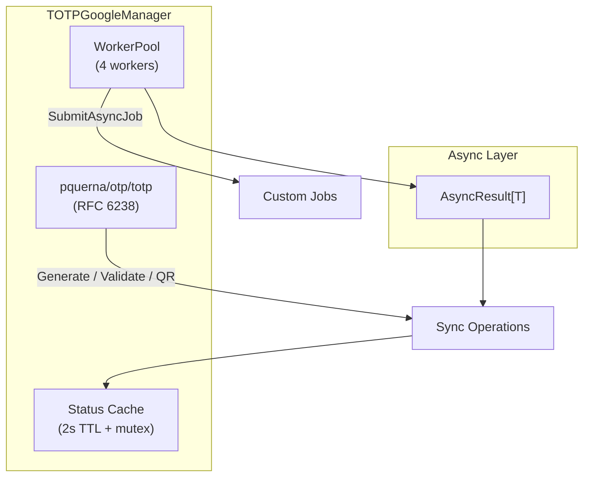
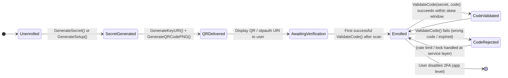

# TOTP Google Manager

## Overview

The `TOTPGoogleManager` provides Google Authenticator compatible TOTP (Time-based One-Time Password, RFC 6238) functionality as a self-contained infrastructure plugin. It supports secret generation, otpauth:// URI creation, PNG QR code generation, code generation and validation with skew tolerance — using direct Viper configuration with zero changes to central config structs.

**Import Path:** `stackyrd/pkg/infrastructure`

**Library:** `github.com/pquerna/otp/totp` (and barcode for QR images)

## Features

- **Google Authenticator Compatible**: SHA1 / 6 or 8 digits / 30s period by default
- **Secret & URI Generation**: Cryptographically secure secrets + full otpauth:// URLs
- **QR Code Images**: PNG QR via modern skip2/go-qrcode (no outdated barcode deps)
- **Code Validation with Skew**: Configurable time skew windows for clock drift
- **Sync + Full Async**: Every operation has `*Async` variant + `SubmitAsyncJob`
- **Worker Pool**: Dedicated 4-worker pool for async TOTP jobs
- **Status & Health**: TTL-cached `GetStatus()` reporting config + readiness
- **GIN Integration Helpers**: Drop-in `GenerateSetupHandler()`, `GenerateQRImageHandler()`, `ValidateHandler()` for instant /2fa endpoints
- **Plugin Architecture**: 100% self-contained, Viper-only config, `init()` auto-register
- **Graceful Disable**: Returns `nil, nil` when `totp_google.enabled=false`

## Quick Start

```go
package main

import (
	"fmt"
	"stackyrd/pkg/infrastructure"
	"stackyrd/pkg/logger"
)

func main() {
	log := logger.NewLogger()

	manager, err := infrastructure.NewTOTPGoogleManager(log)
	if err != nil {
		panic(err)
	}
	if manager == nil {
		fmt.Println("TOTP Google disabled in config")
		return
	}
	defer manager.Close()

	secret, _ := manager.GenerateSecret()
	fmt.Println("Secret:", secret)

	uri, _ := manager.GenerateKeyURI("alice@example.com", secret)
	fmt.Println("URI:", uri)

	qr, _ := manager.GenerateQRCodePNG("alice@example.com", secret)
	fmt.Printf("QR PNG size: %d bytes\n", len(qr))

	valid, _ := manager.ValidateCode(secret, "123456")
	fmt.Println("Code valid:", valid)
}
```

## Architecture

### Core Structs

| Struct                     | Description                                      |
|----------------------------|--------------------------------------------------|
| `TOTPGoogleManager`        | Main manager wrapping TOTP logic + worker pool   |
| `totpGoogleConfig` (local) | Internal config shape (enabled, issuer, digits, period, skew) |

### Concurrency Model



### TOTP User Lifecycle State Diagram



## How It Works

### 1. Initialization Flow

```
NewTOTPGoogleManager(l)
    │
    ├── viper.UnmarshalKey("totp_google", &totpGoogleConfig)
    ├── !cfg.Enabled → return nil, nil
    ├── apply defaults (issuer=Stackyrd, digits=6, period=30, skew=1)
    ├── NewWorkerPool(4).Start()
    └── Return TOTPGoogleManager{issuer, digits, ...}
```

### 2. Secret Generation Flow

```
GenerateSecret()
    │
    └── totp.Generate(GenerateOpts{Issuer, Account, Period, Digits, SHA1})
    └── return key.Secret()  (base32 no-pad)
```

### 3. Key URI + QR Flow (for existing secret)

```
GenerateKeyURI(account, secret)
    │
    ├── base32 decode (no-pad) raw secret
    ├── totp.Generate(..., Secret: raw)
    └── return key.URL()

GenerateQRCodePNG(account, secret)
    │
    ├── same as above → key.Image(256,256)
    └── png.Encode → []byte
```

### 4. Validate Flow (with skew)

```
ValidateCode(secret, code)
    │
    └── totp.ValidateCustom(code, secret, now, {Period, Skew, Digits, SHA1})
    └── tries current +/- skew windows
```

### 5. Async Wrapper Flow

```
ValidateCodeAsync(secret, code)
    │
    └── ExecuteAsync(ctx, func() { return ValidateCode(...) })
    └── Returns *AsyncResult[bool]
```

### 6. Status Caching Flow

```
GetStatus()
    │
    ├── statusMu + 2s TTL check → return cached
    ├── build stats (issuer/digits/period/skew/connected/pool)
    ├── store + expiry
    └── return
```

## Configuration

### Viper Configuration Options (plugin style — no central struct)

| Key                        | Type   | Default     | Description                              |
|----------------------------|--------|-------------|------------------------------------------|
| `totp_google.enabled`      | bool   | false       | Enable/disable the TOTP Google plugin    |
| `totp_google.issuer`       | string | "Stackyrd"  | Issuer name shown in Google Authenticator|
| `totp_google.digits`       | int    | 6           | 6 or 8 digits                            |
| `totp_google.period`       | int    | 30          | Validity period in seconds               |
| `totp_google.skew`         | int    | 1           | Allowed time steps before/after now      |

**Environment variable mapping** (automatic via Viper):
- `TOTP_GOOGLE_ENABLED=true`
- `TOTP_GOOGLE_ISSUER="MyApp"`
- `TOTP_GOOGLE_DIGITS=8`
- `TOTP_GOOGLE_SKEW=2`

### Example YAML

```yaml
totp_google:
  enabled: true
  issuer: "My Company"
  digits: 6
  period: 30
  skew: 1
```

## Usage Examples

### Generate Secret + Enroll User

```go
secret, _ := manager.GenerateSecret()
// store secret securely for the user

uri, _ := manager.GenerateKeyURI("user@example.com", secret)
// show uri or QR to user for scanning
```

### Generate QR PNG

```go
pngBytes, _ := manager.GenerateQRCodePNG("user@example.com", secret)
// serve as image/png or embed
```

### Validate Login Code

```go
ok, err := manager.ValidateCode(userSecret, submittedCode)
if ok { /* login success */ }
```

### Async Operations

```go
res := manager.ValidateCodeAsync(secret, code)
select {
case valid := <-res.Done:  // or use Wait()
    ...
}
```

### Submit Custom Async Job

```go
manager.SubmitAsyncJob(func() {
    // background TOTP related work
})
```

### Status & Health

```go
status := manager.GetStatus()
fmt.Println("Issuer:", status["issuer"])
```

### GIN Endpoint Integration (Drop-in 2FA Routes)

```go
// In any service or router setup:
totp := registry.GetTyped[*infrastructure.TOTPGoogleManager]("totp_google")
if totp != nil {
    auth := r.Group("/api/v1/2fa")
    auth.POST("/setup", totp.GenerateSetupHandler())     // JSON: {account_name}
    auth.GET("/qr", totp.GenerateQRImageHandler())       // ?account=..&secret=.. → raw image/png
    auth.POST("/verify", totp.ValidateHandler())         // JSON {secret, code} → {valid}
}
```

Setup response includes `secret`, `uri`, and `qr_data_url` (base64 data URL ready for ``).

QR image handler allows direct `` with zero JS.

## Error Handling

Methods return standard Go errors. `ValidateCode` returns `false, err` on decode or internal issues.

Common errors:
- `secret is required`
- `invalid secret: ...`
- errors from pquerna/otp (e.g. invalid base32 length)

## Common Pitfalls

### 1. Secret Storage
Never store the secret in plaintext. Encrypt at rest (use encryption_service or similar).

### 2. Clock Skew
Set `skew: 1` (default) or `2` for mobile clients with poor time sync. Higher values reduce security.

### 3. Base32 Secrets
Secrets returned and accepted are unpadded base32. The manager handles decoding internally; do not add padding when passing stored secrets.

### 4. Issuer / Account Names
Special chars in issuer or account must be safely handled — the library URL-encodes them.

### 5. Re-using Generate for same secret
Calling GenerateSecret repeatedly creates new secrets. For existing secrets always use GenerateKeyURI / GenerateQRCodePNG with the stored secret.

### 6. Plugin Not Appearing
Ensure `totp_google.enabled: true` in config and the plugin file is present at build time.

## Advanced Usage

### Custom Period / Digits at Runtime
Currently configured at manager init via Viper. For per-user different settings, store per-user config and implement thin wrapper around the low-level `totp.GenerateCodeCustom` / `ValidateCustom` using the raw secret.

### Direct Use of pquerna Key
```go
// obtain key via internal generate then use key.Image(...) etc.
```

## Internal Algorithms

(See "How It Works" section above for the numbered flows.)

## Dependencies

| Dependency                          | Role                              |
|-------------------------------------|-----------------------------------|
| `github.com/pquerna/otp`            | TOTP/HOTP generation & validation (Google Auth compatible) |
| `github.com/skip2/go-qrcode`        | Modern QR code PNG generation (avoids outdated boombuler/barcode) |
| `github.com/gin-gonic/gin`          | Optional ready-to-mount handlers for instant 2FA endpoints |
| `github.com/spf13/viper`            | Configuration (plugin style)      |
| `stackyrd/pkg/logger`               | Structured logging                |
| `stackyrd/pkg/infrastructure` (internal) | WorkerPool, AsyncResult, registry |
| Standard library                    | `encoding/base32`, `encoding/base64`, `context`, `sync`, `time`, `fmt`, `strings`, `net/http` |

## License

This code is part of the Stackyrd project. See the main project LICENSE file for details.
