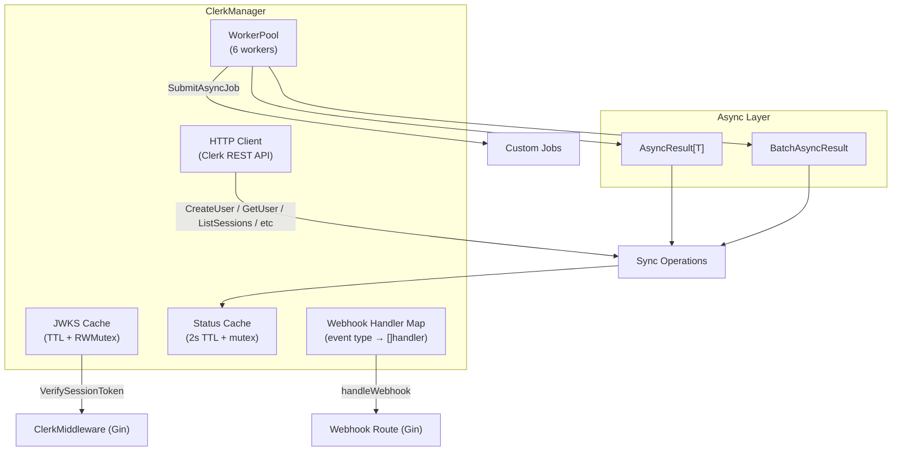
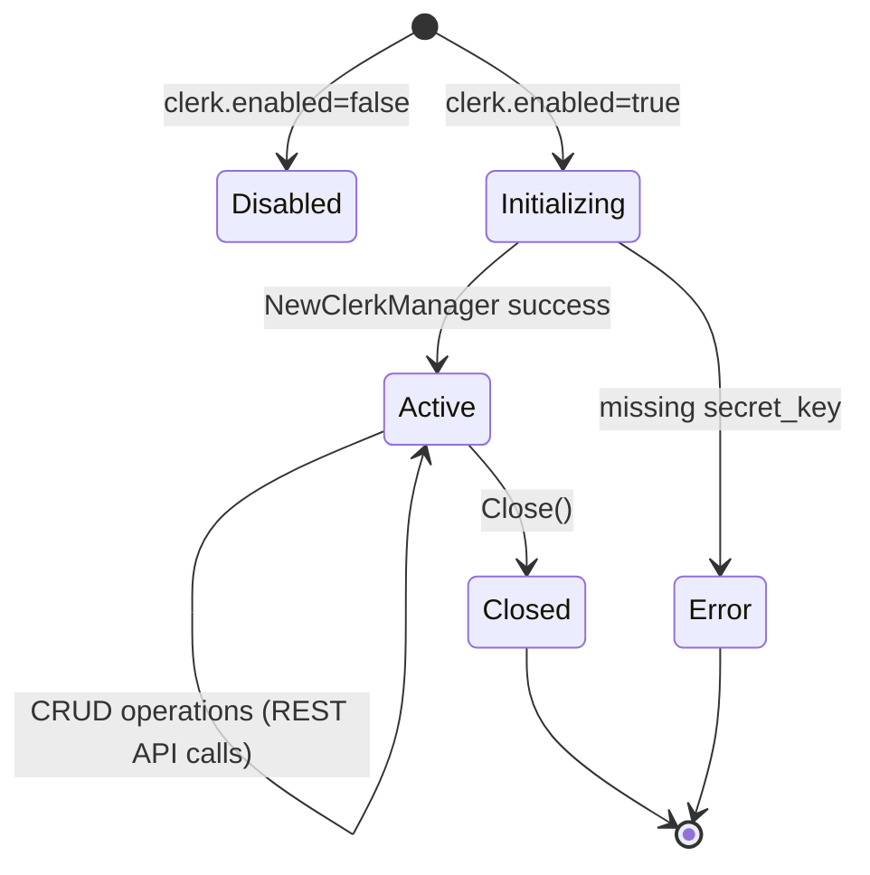

# Clerk Manager

## Overview

The `ClerkManager` is a comprehensive Go library for authentication and user management using the Clerk.com REST API. It provides full coverage of the Clerk API surface including user management, session verification (JWKS-based JWT), organization management, webhook handling with Svix signature verification, allow/block lists, OAuth applications, JWT templates, and Gin middleware — all as a self-contained plugin that requires zero changes to the central configuration structs.

**Import Path:** `stackyrd/pkg/infrastructure`

**Driver:** Clerk REST API (`https://api.clerk.com/v1`) — no external SDK dependency; raw HTTP with Bearer token auth.

## Features

- **Full User Management**: Create, read, update, delete users with ban/unban and lock/unlock controls
- **Rich User Data**: Email addresses, phone numbers, external accounts, public/private/unsafe metadata
- **Session Management**: Get, list, revoke sessions with JWKS-based JWT verification
- **Organization Management**: CRUD organizations with role-based membership management
- **JWT Template Management**: List, get, and update custom JWT templates
- **Allow/Block Lists**: Manage allowlist and blocklist identifiers
- **OAuth Applications**: Create, read, update, delete OAuth applications
- **Webhook Handling**: Svix-compatible webhook signature verification with multi-handler event routing
- **Gin Middleware**: `ClerkMiddleware()` for Bearer token validation and session claim injection
- **Route Registration**: Automatic webhook endpoint via `RouteRegistrar`
- **Complete Async Support**: Every operation has an `*Async` counterpart returning `*AsyncResult[T]`
- **Batch Execution**: `CreateUsersBatchAsync` and `CreateOrgMembershipsBatchAsync`
- **Worker Pool**: 6-worker pool for async jobs + `SubmitAsyncJob`
- **Status & Health**: TTL-cached `GetStatus()` with connection state and JWKS key count
- **Plugin Architecture**: 100% self-contained — configuration read exclusively via Viper, registered via `init()`
- **Graceful Disable**: Returns `nil, nil` when `clerk.enabled=false`

## Quick Start

```go
package main

import (
	"context"
	"fmt"
	"stackyrd/pkg/infrastructure"
	"stackyrd/pkg/logger"
)

func main() {
	log := logger.NewLogger()

	manager, err := infrastructure.NewClerkManager(log)
	if err != nil {
		panic(err)
	}
	if manager == nil {
		fmt.Println("Clerk disabled in config")
		return
	}
	defer manager.Close()

	ctx := context.Background()

	users, err := manager.ListUsers(ctx, infrastructure.ClerkListUsersParams{Limit: 10})
	if err != nil {
		panic(err)
	}
	fmt.Printf("Found %d users\n", len(users))
}
```

## Architecture

### Core Structs

| Struct | Description |
|--------|-------------|
| `ClerkManager` | Main manager wrapping Clerk REST API + worker pool + JWKS cache |
| `ClerkUser` | Clerk user with emails, phones, metadata, ban/lock state |
| `ClerkSession` | Clerk session with status, expiry, client reference |
| `ClerkOrganization` | Organization with slug, membership limit, metadata |
| `ClerkOrganizationMembership` | User-organization link with role |
| `ClerkJWTTemplate` | Custom JWT template with claims and lifetime |
| `ClerkOAuthApplication` | OAuth app with client ID/secret, callback URLs, scopes |
| `ClerkIdentifier` | Allow/block list entry |
| `ClerkWebhookEvent` | Webhook payload with type, object, data |
| `ClerkJWTClaims` | Parsed JWT claims with user ID, session, org context |
| `jwtVerificationKey` (unexported) | JWKS key entry (kid, n, e) for token verification |

### Concurrency Model



### State Diagram



## How It Works

### 1. Initialization Flow

```
NewClerkManager(l)
    │
    ├── viper.UnmarshalKey("clerk", &clerkConfig)
    ├── !cfg.Enabled → return nil, nil
    ├── cfg.SecretKey == "" → return error
    ├── baseURL := cfg.BaseURL (default "https://api.clerk.com/v1")
    ├── NewWorkerPool(6).Start()
    ├── Set defaults for routes, middleware config
    └── Return ClerkManager{secretKey, baseURL, Pool, ...}
```

### 2. REST API Request Flow

```
doRequest(ctx, method, path, body)
    │
    ├── Marshal body to JSON (if non-nil)
    ├── http.NewRequestWithContext(method, baseURL + path, body)
    ├── Set Authorization: Bearer <secretKey>
    ├── Set Content-Type: application/json
    ├── httpClient.Do(req)
    ├── Read response body
    ├── Status non-2xx → parse Clerk API error → return error
    └── Return raw JSON bytes
```

### 3. JWT Verification Flow (JWKS)

```
VerifySessionToken(tokenStr)
    │
    ├── fetchJWKS(ctx) → GET /jwks → cache keys for TTL
    ├── jwt.ParseWithClaims(token, &ClerkJWTClaims{}, keyFunc)
    │     └── keyFunc: extract kid from header
    │           └── find matching JWK key → rsaPublicKey(n, e)
    │                 └── base64url decode n, e
    │                 └── build *rsa.PublicKey
    ├── Validate claims + signature
    └── Return ClerkJWTClaims{UserID, SessionID, OrgID, ...}
```

### 4. Webhook Verification Flow

```
handleWebhook(c *gin.Context)
    │
    ├── Read body
    ├── Extract svix-id, svix-timestamp, svix-signature headers
    ├── VerifyWebhookSignature(body, svixID, svixTimestamp, svixSignature)
    │     └── HMAC-SHA256(svixid.svixTimestamp.body, webhookSecret)
    │     └── Compare with each signature in svix-signature
    ├── Unmarshal body → ClerkWebhookEvent
    ├── Dispatch to all "*" handlers + type-specific handlers
    └── Return 200 OK or 500 on handler error
```

### 5. Async Wrapper Flow

```
GetUserAsync(ctx, userID)
    │
    └── ExecuteAsync(ctx, func() (*ClerkUser, error) {
            return GetUser(ctx, userID)
        })
    └── Returns *AsyncResult[*ClerkUser]
```

### 6. Batch Async Flow

```
CreateUsersBatchAsync(ctx, users)
    │
    ├── Build []AsyncOperation[*ClerkUser] from slice
    └── ExecuteBatchAsync(ctx, ops, 10)
```

### 7. Status Caching Flow

```
GetStatus()
    │
    ├── statusMu + check 2s TTL cache → return cached
    ├── GET /users?limit=1 to verify API connectivity
    ├── Collect JWKS key count, webhook handler count
    ├── store in cache + update expiry
    └── return fresh stats
```

## Configuration

### Viper Configuration Options (plugin style — no central struct)

| Key | Type | Default | Description |
|-----|------|---------|-------------|
| `clerk.enabled` | bool | false | Enable/disable the Clerk plugin |
| `clerk.secret_key` | string | "" | Clerk Secret Key (required when enabled) |
| `clerk.webhook_secret` | string | "" | Clerk webhook signing secret (Svix) |
| `clerk.base_url` | string | `https://api.clerk.com/v1` | Clerk API base URL |
| `clerk.routes.base_path` | string | `/api/v1/auth/clerk` | Base path for Clerk webhook routes |
| `clerk.routes.webhook_path` | string | `/webhook` | Path suffix for webhook endpoint |
| `clerk.middleware.leeway` | int | 60 | JWT validation leeway in seconds |
| `clerk.middleware.cache_ttl` | int | 300 | JWKS cache TTL in seconds |

**Environment variable mapping** (automatic via Viper):
- `CLERK_ENABLED=true`
- `CLERK_SECRET_KEY="sk_test_..."`
- `CLERK_WEBHOOK_SECRET="whsec_..."`
- `CLERK_BASE_URL="https://api.clerk.com/v1"`
- `CLERK_ROUTES_BASE_PATH="/api/v1/auth/clerk"`
- `CLERK_ROUTES_WEBHOOK_PATH="/webhook"`
- `CLERK_MIDDLEWARE_LEEWAY=60`
- `CLERK_MIDDLEWARE_CACHE_TTL=300`

### Example YAML

```yaml
clerk:
  enabled: true
  secret_key: "sk_test_your_secret_key_here"
  webhook_secret: "whsec_your_webhook_secret_here"
  routes:
    base_path: "/api/v1/auth/clerk"
    webhook_path: "/webhook"
  middleware:
    leeway: 60
    cache_ttl: 300
```

## Usage Examples

### Basic CRUD — Users

```go
ctx := context.Background()

// Create user
user, err := manager.CreateUser(ctx, infrastructure.ClerkCreateUserParams{
    EmailAddress: []string{"alice@example.com"},
    FirstName:    "Alice",
    LastName:     "Smith",
    Password:     "securepassword123",
})

// Get user
user, err = manager.GetUser(ctx, user.ID)

// Update user
user, err = manager.UpdateUser(ctx, user.ID, infrastructure.ClerkUpdateUserParams{
    FirstName: "Alicia",
})

// List users with filter
users, err := manager.ListUsers(ctx, infrastructure.ClerkListUsersParams{
    Limit:  100,
    Query:  "alice",
    Banned: boolPtr(false),
})

// Delete user
err = manager.DeleteUser(ctx, user.ID)
```

### Ban / Lock Controls

```go
// Ban a user
user, _ = manager.BanUser(ctx, userID)

// Unban
user, _ = manager.UnbanUser(ctx, userID)

// Lock a user
user, _ = manager.LockUser(ctx, userID)

// Unlock
user, _ = manager.UnlockUser(ctx, userID)
```

### Metadata Management

```go
user, err := manager.UpdateUserMetadata(ctx, userID,
    map[string]interface{}{"tier": "premium", "onboarded": true},
    map[string]interface{}{"internal_note": "VIP customer"},
    map[string]interface{}{"temporary_flag": "promo_2024"},
)
```

### Session Management

```go
// List sessions for a user
sessions, err := manager.ListSessions(ctx, infrastructure.ClerkListSessionsParams{
    UserID: userID,
    Limit:  50,
})

// Revoke a session
session, err = manager.RevokeSession(ctx, sessionID)

// Verify a session token
claims, err := manager.VerifySessionToken(bearerToken)
fmt.Println("User:", claims.UserID, "Org:", claims.OrgID)
```

### Organizations

```go
// Create organization
org, err := manager.CreateOrganization(ctx, infrastructure.ClerkCreateOrgParams{
    Name:      "Acme Corp",
    Slug:      "acme-corp",
    CreatedBy: userID,
})

// Add member
membership, err := manager.CreateOrganizationMembership(ctx, org.ID, userID, "admin")

// List memberships
members, err := manager.ListOrganizationMemberships(ctx, org.ID)

// Update role
membership, err = manager.UpdateOrganizationMembership(ctx, org.ID, userID, "basic_member")

// Remove member
err = manager.DeleteOrganizationMembership(ctx, org.ID, userID)
```

### Webhook Handling

```go
// Register webhook handlers
manager.RegisterWebhookHandler("user.created", func(event infrastructure.ClerkWebhookEvent) error {
    fmt.Println("User created:", string(event.Data))
    return nil
})
manager.RegisterWebhookHandler("*", func(event infrastructure.ClerkWebhookEvent) error {
    log.Printf("Webhook event: %s", event.Type)
    return nil
})

// Webhook endpoint is automatically registered via RouteRegistrar
// POST /api/v1/auth/clerk/webhook (Svix-signed)
```

### Gin Middleware

```go
r := gin.Default()

// Protect routes with Clerk middleware
r.GET("/api/protected", manager.ClerkMiddleware(), func(c *gin.Context) {
    userID := c.GetString("clerk_user_id")
    orgID := c.GetString("clerk_org_id")
    orgRole := c.GetString("clerk_org_role")
    c.JSON(200, gin.H{
        "user_id":  userID,
        "org_id":   orgID,
        "org_role": orgRole,
    })
})
```

### Async Operations

```go
result := manager.GetUserAsync(ctx, userID)
user, err := result.Wait()
```

### Batch Operations

```go
users := []infrastructure.ClerkCreateUserParams{
    {EmailAddress: []string{"a@x.com"}, Password: "pass1"},
    {EmailAddress: []string{"b@x.com"}, Password: "pass2"},
}
batchResult := manager.CreateUsersBatchAsync(ctx, users)
results := batchResult.WaitAll()
```

### Status & Health

```go
status := manager.GetStatus()
fmt.Println("Connected:", status["connected"])
fmt.Println("JWKS keys:", status["jwks_keys_count"])
fmt.Println("Webhook handlers:", status["webhook_handlers"])
```

### Submit Custom Async Job

```go
manager.SubmitAsyncJob(func() {
    users, _ := manager.ListUsers(context.Background(),
        infrastructure.ClerkListUsersParams{Limit: 100})
    fmt.Printf("Found %d users\n", len(users))
})
```

## Error Handling

All methods return standard Go errors. API errors returned by Clerk include error code, message, and optional long message with metadata.

Common errors:
- `clerk.secret_key is required when clerk is enabled`
- `clerk API error (status XXX): <error message>`
- `missing svix headers` (webhook endpoint without Svix headers)
- `webhook signature mismatch` (invalid or tampered webhook)
- `invalid session token: ...` (expired, wrong kid, bad signature)

## Common Pitfalls

### 1. Secret Key Required
The `clerk.secret_key` config value is mandatory when `clerk.enabled=true`. If omitted, `NewClerkManager` returns an error.

### 2. JWKS Cache Staleness
Clerk rotates signing keys periodically. The JWKS cache defaults to 300s TTL. For faster rotation, reduce `clerk.middleware.cache_ttl`.

### 3. Webhook Secret Mismatch
The webhook secret from the Clerk Dashboard must match `clerk.webhook_secret` exactly. Use the full `whsec_...` string from Clerk.

### 4. Svix Headers Required
Webhook verification requires all three Svix headers: `svix-id`, `svix-timestamp`, `svix-signature`. Requests missing any header are rejected with 400.

### 5. Rate Limiting
Clerk API has rate limits. Use batch operations and async wrappers to manage request volume. The worker pool provides concurrency control.

### 6. JWT Verification on First Request
The first `VerifySessionToken` call fetches JWKS from Clerk's API, which adds latency. Subsequent calls use the cached keys.

## Advanced Usage

### Custom Webhook Event Filtering

```go
manager.RegisterWebhookHandler("user.created", func(event infrastructure.ClerkWebhookEvent) error {
    var user infrastructure.ClerkUser
    json.Unmarshal(event.Data, &user)
    return sendWelcomeEmail(user.EmailAddresses[0].Email)
})
manager.RegisterWebhookHandler("organization.created", func(event infrastructure.ClerkWebhookEvent) error {
    var org infrastructure.ClerkOrganization
    json.Unmarshal(event.Data, &org)
    return provisionOrgResources(org.ID)
})
```

### Using the HTTP Client Directly

The internal `http.Client` is configured with a 30s timeout. For custom transports or retry logic, access via the exported `doRequest` is available through the manager methods.

### Multi-Tenant Org Verification

```go
claims, err := manager.VerifySessionToken(tokenStr)
if claims.OrgID != "org_required" {
    return fmt.Errorf("access denied: wrong organization")
}
```

### Programmatic User Creation with Metadata

```go
user, err := manager.CreateUser(ctx, infrastructure.ClerkCreateUserParams{
    EmailAddress:     []string{"dev@company.com"},
    Password:         "secure",
    FirstName:        "Dev",
    PublicMetadata:   map[string]interface{}{"department": "engineering"},
    PrivateMetadata:  map[string]interface{}{"employee_id": "E1234"},
    SkipPasswordChecks: true,
})
```

## Internal Algorithms

(See "How It Works" section above for the numbered flows covering initialization, REST API requests, JWT verification, webhook verification, async wrappers, batch operations, and status caching.)

## Dependencies

| Dependency | Role |
|------------|------|
| Standard library | `net/http`, `crypto/hmac`, `crypto/rsa`, `crypto/sha256`, `encoding/json`, `math/big` |
| `github.com/spf13/viper` | Configuration (plugin style) |
| `github.com/gin-gonic/gin` | HTTP middleware and route registration |
| `github.com/golang-jwt/jwt/v5` | JWT token parsing and RSA signature verification |
| `stackyrd/pkg/logger` | Structured logging |
| `stackyrd/pkg/infrastructure` (internal) | `WorkerPool`, `AsyncResult`, `ExecuteAsync`, `ExecuteBatchAsync`, registry |

## License

This code is part of the Stackyrd project. See the main project LICENSE file for details.
