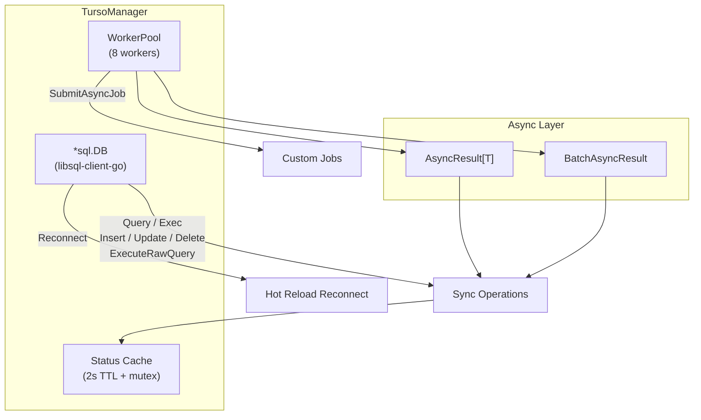

# Turso Manager

## Overview

The `TursoManager` is a comprehensive Go library for Turso — the distributed SQLite built on libSQL — using the official `tursodatabase/libsql-client-go` driver. It supports both **remote** (libsql, HTTP, WebSocket) and **local** (file-based SQLite) connection modes via automatic URL scheme detection, a rich synchronous API, complete asynchronous wrappers, batch operations, raw result mapping, worker pool concurrency, hot-reload connection reconfiguration, and production-grade status/health reporting — all as a self-contained plugin that requires zero changes to the central configuration structs.

**Import Path:** `stackyrd/pkg/infrastructure`

**Driver:** `github.com/tursodatabase/libsql-client-go/libsql` (official Turso Go SDK)

## Features

- **Multiple URL Schemes**: Automatic detection — `libsql://`, `https://`, `http://`, `wss://`, `ws://` for remote; `file:` for local SQLite
- **Full database/sql Compatibility**: `*sql.DB`, `Query`, `QueryRow`, `Exec`, `Rows`, `Result`
- **Rich Semantic API**: `Select`, `Insert`, `Update`, `Delete`, `ExecuteRawQuery` returning `[]map[string]interface{}`
- **Hot Reload Reconnect**: `Reconnect()` to swap URL and auth token without service restart
- **Complete Async Support**: Every operation has an `*Async` counterpart returning `*AsyncResult[T]`
- **Batch Execution**: `ExecuteBatchAsync` for multiple queries with shared context
- **Worker Pool**: 8-worker pool for async jobs + `SubmitAsyncJob`
- **Status & Health**: TTL-cached `GetStatus()` with connection stats (Open/InUse/Idle/Wait)
- **Connection Manager**: `TursoConnectionManager` for named multi-database access (`GetConnection`, `GetAllConnections`, `GetDefaultConnection`)
- **DB Info**: `GetDBInfo()` returns URL, connection mode, and pool statistics
- **Plugin Architecture**: 100% self-contained — configuration read exclusively via Viper, registered via `init()`
- **Graceful Disable**: Returns `nil, nil` when `turso.enabled=false`

## Quick Start

```go
package main

import (
	"context"
	"fmt"
	"stackyrd/pkg/infrastructure"
	"stackyrd/pkg/logger"
)

func main() {
	log := logger.NewLogger()

	// Create Turso manager (configuration via viper under "turso")
	manager, err := infrastructure.NewTursoDB(log)
	if err != nil {
		panic(err)
	}
	if manager == nil {
		fmt.Println("Turso disabled in config")
		return
	}
	defer manager.Close()

	ctx := context.Background()

	// Create table and insert
	_, err = manager.Exec(ctx, `
		CREATE TABLE IF NOT EXISTS users (
			id INTEGER PRIMARY KEY,
			name TEXT NOT NULL
		)`)
	if err != nil {
		panic(err)
	}

	id, err := manager.Insert(ctx, "INSERT INTO users (name) VALUES (?)", "Alice")
	if err != nil {
		panic(err)
	}
	fmt.Printf("Inserted user with ID: %d\n", id)

	// Raw query returning maps
	rows, err := manager.ExecuteRawQuery(ctx, "SELECT * FROM users")
	if err != nil {
		panic(err)
	}
	fmt.Printf("Users: %+v\n", rows)
}
```

## Architecture

### Core Structs

| Struct                      | Description                                      |
|----------------------------|--------------------------------------------------|
| `TursoManager`             | Main manager wrapping `*sql.DB` + worker pool   |
| `TursoConnectionManager`   | Multi-connection container for named DBs        |
| `tursoConfig` (local)      | Internal single-connection config shape         |
| `tursoMultiConfig` (local) | Internal multi-connection config shape          |

### Concurrency Model



## How It Works

### 1. Initialization Flow

```
NewTursoDB(l)
    │
    ├── viper.UnmarshalKey("turso", &tursoConfig)
    ├── !cfg.Enabled → return nil, nil
    ├── detectConnectionMode(cfg.URL) → "remote" | "local"
    ├── libsql.NewConnector(url, opts...)
    ├── sql.OpenDB(connector)
    ├── Ping()
    ├── SetMaxOpenConns(10), SetMaxIdleConns(5)
    ├── NewWorkerPool(8).Start()
    └── Return TursoManager{DB, Pool}
```

### 2. URL Scheme Detection

```
detectConnectionMode(url)
    │
    ├── "file:"  → "local" (embedded SQLite)
    ├── "libsql://" → "remote" (Turso cloud)
    ├── "https://", "http://" → "remote"
    ├── "wss://", "ws://" → "remote"
    └── default → "remote"
```

### 3. Multi-Connection Initialization

```
NewTursoConnectionManager(l)
    │
    ├── viper.UnmarshalKey("turso", &tursoMultiConfig)
    ├── !mcfg.Enabled → return nil, nil
    ├── For each enabled connection:
    │     ├── build tursoConfig from connection entry
    │     ├── newTursoDBFromConfig(single)
    │     └── store in connections map[name]
    └── Return TursoConnectionManager
```

### 4. Query Execution Flow

```
Query(ctx, sql, args...)
    │
    └── DB.QueryContext(ctx, sql, args...)
```

### 5. Hot Reload Reconnect Flow

```
Reconnect(ctx, newURL, newToken)
    │
    ├── libsql.NewConnector(newURL, WithAuthToken(newToken))
    ├── sql.OpenDB(newConnector)
    ├── Ping()                          // verify new credentials
    ├── SetMaxOpenConns(10), etc.
    ├── Swap DB pointer
    └── Close old DB
```

### 6. Async Wrapper Flow (example: InsertAsync)

```
InsertAsync(ctx, sql, args)
    │
    └── ExecuteAsync(ctx, func() (int64, error) {
            return Insert(ctx, sql, args...)
        })
    └── Returns *AsyncResult[int64] with Ch / ErrCh
```

### 7. Batch Async Flow

```
ExecuteBatchAsync(ctx, queries, args)
    │
    ├── length check
    ├── build []AsyncOperation[sql.Result]
    └── ExecuteBatchAsync(ctx, ops, 20)
```

### 8. Status Caching Flow

```
GetStatus()
    │
    ├── statusMu + check 2s TTL cache → return cached
    ├── actual DB.Ping()
    ├── detect connection mode from URL
    ├── collect sql.DB.Stats()
    ├── store in cache + update expiry
    └── return fresh stats
```

## Configuration

### Viper Configuration Options (plugin style — no central struct)

| Key                          | Type     | Default     | Description                              |
|-----------------------------|----------|-------------|------------------------------------------|
| `turso.enabled`             | bool     | false       | Enable/disable the Turso plugin          |
| `turso.url`                 | string   | ""          | Turso database URL (libsql://, https://, file:, etc.) |
| `turso.auth_token`          | string   | ""          | JWT auth token for Turso access          |
| `turso.tls`                 | bool     | nil         | Force TLS on/off (nil = auto-detect)     |
| `turso.connections`         | array    | []          | Multi-connection list (each has name, enabled, url, auth_token, tls) |

**Environment variable mapping** (automatic via Viper):
- `TURSO_ENABLED=true`
- `TURSO_URL=libsql://my-database.turso.io`
- `TURSO_AUTH_TOKEN=eyJhbGciOiJIUzI1NiJ9...`
- `TURSO_TLS=true`
- `TURSO_CONNECTIONS_0_NAME=primary`
- `TURSO_CONNECTIONS_0_URL=libsql://primary.turso.io`

### Example YAML (remote — libsql)

```yaml
turso:
  enabled: true
  url: "libsql://my-database.turso.io"
  auth_token: "eyJhbGciOiJIUzI1NiJ9..."
```

### Example YAML (remote — HTTPS)

```yaml
turso:
  enabled: true
  url: "https://my-database.turso.io"
  auth_token: "eyJhbGciOiJIUzI1NiJ9..."
```

### Example YAML (local SQLite file)

```yaml
turso:
  enabled: true
  url: "file:data/turso.db"
```

### Example YAML (multi-connection)

```yaml
turso:
  enabled: true
  connections:
    - name: primary
      enabled: true
      url: "libsql://primary.turso.io"
      auth_token: "eyJhbG...token1..."
    - name: analytics
      enabled: true
      url: "libsql://analytics.turso.io"
      auth_token: "eyJhbG...token2..."
    - name: local_backup
      enabled: true
      url: "file:data/backup.db"
```

## Usage Examples

### Basic CRUD

```go
ctx := context.Background()

manager.Exec(ctx, `CREATE TABLE IF NOT EXISTS products (id INTEGER PRIMARY KEY, name TEXT)`)
manager.Insert(ctx, "INSERT INTO products (name) VALUES (?)", "Laptop")
manager.Update(ctx, "UPDATE products SET name=? WHERE id=?", "MacBook", 1)
manager.Delete(ctx, "DELETE FROM products WHERE id=?", 1)

rows, _ := manager.Query(ctx, "SELECT * FROM products WHERE name LIKE ?", "%Book%")
defer rows.Close()
```

### Raw Query (map results)

```go
results, err := manager.ExecuteRawQuery(ctx, "SELECT id, name FROM users LIMIT 100")
for _, row := range results {
    fmt.Printf("%v: %v\n", row["id"], row["name"])
}
```

### Async Operations

```go
result := manager.InsertAsync(ctx, "INSERT ...", "Bob")
select {
case id := <-result.Ch:
    fmt.Println("Inserted:", id)
case err := <-result.ErrCh:
    fmt.Println("Error:", err)
}
```

### Batch Async

```go
queries := []string{
    "INSERT INTO events (type) VALUES (?)",
    "UPDATE stats SET count = count + 1",
}
args := [][]interface{}{{"login"}, {}}

batch := manager.ExecuteBatchAsync(ctx, queries, args)
```

### Hot Reload Reconnect (change URL or auth token)

```go
err := manager.Reconnect(ctx, "libsql://new-database.turso.io", "new-jwt-token")
if err != nil {
    fmt.Println("Reconnect failed:", err)
}
```

### Hot Reload Reconnect (async)

```go
result := manager.ReconnectAsync(ctx, "libsql://new-database.turso.io", "new-jwt-token")
select {
case <-result.Done:
    fmt.Println("Reconnection complete")
case err := <-result.ErrCh:
    fmt.Println("Reconnection error:", err)
}
```

### Multi-Connection Usage

```go
m, _ := infrastructure.NewTursoConnectionManager(log)
primary, _ := m.GetConnection("primary")
analytics, _ := m.GetConnection("analytics")

primary.Insert(ctx, "INSERT INTO ...")
analytics.Insert(ctx, "INSERT INTO analytics ...")
```

### Status & Health

```go
status := manager.GetStatus()
fmt.Println("Connected:", status["connected"])
fmt.Println("Mode:", status["connection_mode"])
fmt.Println("In use:", status["in_use"])
```

### Database Info

```go
info, err := manager.GetDBInfo(ctx)
if err != nil {
    fmt.Println("Error:", err)
}
fmt.Printf("Connection mode: %v\n", info["connection_mode"])
fmt.Printf("Open connections: %v\n", info["open_connections"])
```

### Submit Custom Async Job

```go
manager.SubmitAsyncJob(func() {
    // long running work using the DB
    rows, _ := manager.Query(context.Background(), "SELECT count(*) FROM large_table")
    defer rows.Close()
})
```

## Error Handling

All methods follow standard Go error patterns. `GetStatus()` returns `connected=false` on nil receiver or failed ping.

Common errors:
- `turso url is required`
- `failed to create turso connector`
- `failed to connect to turso`
- `failed to create new connector`
- `failed to verify new connection`
- `database connection is nil`
- `queries and args length mismatch`

## Common Pitfalls

### 1. Auth Token Expiry
Turso auth tokens expire. Use `Reconnect()` before expiry to hot-reload credentials. Monitor `GetStatus()` for `connected=false`.

### 2. File URLs for Local Mode
Use `file:` prefix for local SQLite files (e.g., `file:data/turso.db`). A local SQLite driver (`ncruces/go-sqlite3`) must be imported to use file mode.

### 3. TLS Configuration
By default, `libsql://` URLs use TLS; `http://` and `ws://` do not. Use the `turso.tls` config option to override when needed.

### 4. Connection Pool Settings
The manager sets conservative defaults (MaxOpen=10, ConnMaxLifetime=5m). For high-throughput workloads, tune via the underlying `*sql.DB` if needed.

### 5. Multi-Connection URLs
Each connection in the `connections` array must have a unique name. URL collisions are supported but each connection pool is independent.

### 6. Plugin Not Appearing
Ensure the file is compiled in (it is via package import of `infrastructure`). Check `viper.GetBool("turso.enabled")`.

## Advanced Usage

### Transactions (manual)

```go
tx, _ := manager.DB.BeginTx(ctx, nil)
defer tx.Rollback()
tx.ExecContext(ctx, "INSERT INTO ...")
tx.Commit()
```

### Using the Raw *sql.DB

```go
db := manager.DB   // full access to *sql.DB
```

### Periodic Health Check

```go
ticker := time.NewTicker(30 * time.Second)
go func() {
    for range ticker.C {
        status := manager.GetStatus()
        if !status["connected"].(bool) {
            log.Printf("Turso connection lost, reconnecting...")
        }
    }
}()
```

## Internal Algorithms

(See "How It Works" section above for the numbered flows.)

## Dependencies

| Dependency                                     | Role                              |
|------------------------------------------------|-----------------------------------|
| `github.com/tursodatabase/libsql-client-go`    | Official Turso Go SDK (libSQL)   |
| `github.com/spf13/viper`                       | Configuration (plugin style)      |
| `stackyrd/pkg/logger`                          | Structured logging                |
| `stackyrd/pkg/infrastructure` (internal)       | WorkerPool, AsyncResult, registry |
| Standard library                               | `database/sql`, `context`, `sync`, `time`, `fmt` |

## License

This code is part of the Stackyrd project. See the main project LICENSE file for details.
