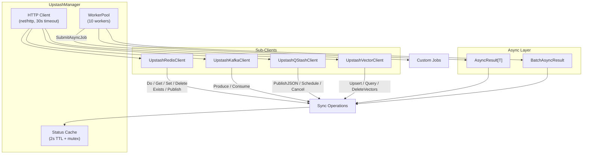
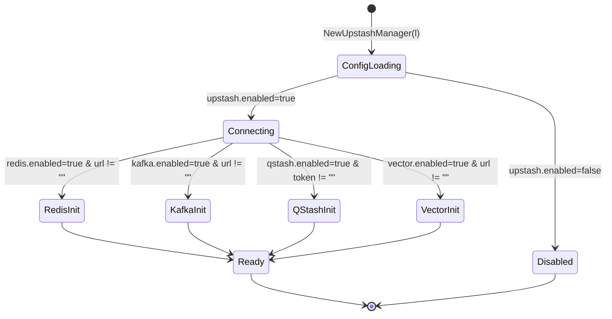

# Upstash Manager

## Overview

The `UpstashManager` is a comprehensive Go library for interacting with Upstash serverless data platform — Redis (HTTP/REST), Kafka, QStash (message queue & scheduling), and Vector (vector database). All services are accessed via REST API, making them ideal for serverless and edge environments where persistent TCP connections are impractical. It provides complete synchronous and asynchronous APIs, batch operations, worker pool concurrency, and production-grade status/health reporting — all as a self-contained plugin that requires zero changes to the central configuration structs.

**Import Path:** `stackyrd/pkg/infrastructure`

**Libraries:** Standard `net/http`, `encoding/json` (no external SDK required — all services consumed via REST)

## Features

- **Four Services in One Plugin**: Upstash Redis (REST), Kafka, QStash, and Vector under a single `UpstashManager`
- **Serverless-Native**: All operations are HTTP-based — no persistent TCP connections needed
- **Rich REST Redis API**: `Do`, `Get`, `Set`, `Delete`, `Exists`, `Publish` — covering a majority of Redis commands via generic `Do` method
- **Kafka Producer / Consumer**: REST-based produce and consume with consumer group support
- **QStash Queue & Schedule**: Publish JSON or raw messages, schedule with delays, cancel pending messages
- **Vector Database**: Upsert, Query (k-NN search), and Delete vectors
- **Complete Async Support**: Every operation has an `*Async` counterpart returning `*AsyncResult[T]`
- **Batch Execution**: `SetBatchAsync` for Redis, `ProduceBatchAsync` for Kafka
- **Worker Pool**: 10-worker pool for async jobs + `SubmitAsyncJob`
- **Status & Health**: TTL-cached `GetStatus()` with per-service ping checks
- **Plugin Architecture**: 100% self-contained — configuration read exclusively via Viper, registered via `init()`
- **Graceful Disable**: Returns `nil, nil` when `upstash.enabled=false`

## Quick Start

```go
package main

import (
	"context"
	"fmt"
	"stackyrd/pkg/infrastructure"
	"stackyrd/pkg/logger"
)

func main() {
	log := logger.NewLogger()

	// Create Upstash manager (configuration via viper under "upstash")
	manager, err := infrastructure.NewUpstashManager(log)
	if err != nil {
		panic(err)
	}
	if manager == nil {
		fmt.Println("Upstash disabled in config")
		return
	}
	defer manager.Close()

	ctx := context.Background()

	// Upstash Redis — set and get
	if manager.Redis != nil {
		err := manager.Redis.Set(ctx, "greeting", "Hello from Upstash!", 3600)
		if err != nil {
			panic(err)
		}
		val, _ := manager.Redis.Get(ctx, "greeting")
		fmt.Printf("Redis GET: %s\n", val)
	}

	// Upstash QStash — enqueue a message
	if manager.QStash != nil {
		err := manager.QStash.PublishJSON(ctx, "my-queue", map[string]string{
			"event": "user.signup",
			"email": "user@example.com",
		})
		if err != nil {
			panic(err)
		}
		fmt.Println("QStash message enqueued")
	}
}
```

## Architecture

### Core Structs

| Struct                      | Description                                      |
|----------------------------|--------------------------------------------------|
| `UpstashManager`           | Main manager wrapping HTTP client + sub-clients  |
| `UpstashRedisClient`       | Upstash Redis REST client (command-based API)    |
| `UpstashKafkaClient`       | Upstash Kafka REST producer / consumer           |
| `UpstashQStashClient`      | Upstash QStash message queue & scheduler         |
| `UpstashVectorClient`      | Upstash Vector upsert / query / delete           |
| `VectorEntry`              | Input vector with ID, values, optional metadata  |
| `VectorResult`             | Query result with ID, score, optional metadata   |
| `upstashConfig` (local)    | Internal configuration shape                     |

### Concurrency Model



### State Diagram



## How It Works

### 1. Initialization Flow

```
NewUpstashManager(l)
    │
    ├── viper.UnmarshalKey("upstash", &upstashConfig)
    ├── !cfg.Enabled → return nil, nil
    ├── Create http.Client with 30s timeout, 50 max idle conns
    ├── If cfg.Redis.Enabled && cfg.Redis.URL != "":
    │     └── newUpstashRedisClient(url, token, hc)
    ├── If cfg.Kafka.Enabled && cfg.Kafka.URL != "":
    │     └── newUpstashKafkaClient(url, token, hc)
    ├── If cfg.QStash.Enabled && cfg.QStash.Token != "":
    │     └── newUpstashQStashClient(token, hc)
    ├── If cfg.Vector.Enabled && cfg.Vector.URL != "":
    │     └── newUpstashVectorClient(url, token, hc)
    └── Return UpstashManager{config, http, sub-clients}
```

### 2. Redis Command Execution Flow

```
Redis.Do(ctx, dest, cmd, args...)
    │
    ├── json.Marshal([cmd, args...])
    ├── POST <redis.url> with JSON body
    ├── Authorization: Bearer <token>
    ├── Parse response {result, error}
    ├── error field set → return error
    ├── dest != nil → json.Unmarshal(result, dest)
    └── return nil
```

### 3. Kafka Produce Flow

```
Kafka.Produce(ctx, topic, messages...)
    │
    ├── POST <kafka.url>/topics/<topic>
    ├── Body: {"messages": [...], "topic": "..."}
    ├── Authorization: Bearer <token>
    ├── status >= 400 → return error
    └── return nil
```

### 4. QStash Publish Flow

```
QStash.PublishJSON(ctx, queueName, msg)
    │
    ├── POST https://qstash.upstash.io/v1/messages
    ├── Body: {"queue": "...", "body": ..., "contentType": "application/json"}
    ├── Authorization: Bearer <token>
    ├── status >= 400 → return error
    └── return nil
```

### 5. Vector Query Flow

```
Vector.Query(ctx, index, vector, topK)
    │
    ├── POST <vector.url>/vectors/query
    ├── Body: {"index": "...", "vector": [...], "topK": N}
    ├── Parse response {results: [...]}
    └── return []VectorResult
```

### 6. Async Wrapper Flow (example: SetAsync)

```
SetAsync(ctx, key, value, ttl)
    │
    └── ExecuteAsync(ctx, func() (struct{}, error) {
            return Set(ctx, key, value, ttl...)
        })
    └── Returns *AsyncResult[struct{}] with Done channel
```

### 7. Batch Async Flow

```
SetBatchAsync(ctx, kvPairs, ttl)
    │
    ├── build []AsyncOperation[struct{}] from map
    └── ExecuteBatchAsync(ctx, ops, 20)
```

### 8. Status Caching Flow

```
GetStatus()
    │
    ├── statusMu + check 2s TTL cache → return cached
    ├── collect config booleans
    ├── Redis: Do(PING) → redis_ok / redis_error
    ├── store in cache + update expiry
    └── return fresh stats
```

## Configuration

### Viper Configuration Options (plugin-style — no central struct)

| Key                        | Type   | Default     | Description                              |
|---------------------------|--------|-------------|------------------------------------------|
| `upstash.enabled`         | bool   | false       | Enable/disable the Upstash plugin        |
| `upstash.redis.enabled`   | bool   | false       | Enable Upstash Redis REST client         |
| `upstash.redis.url`       | string | ""          | Upstash Redis REST URL                   |
| `upstash.redis.token`     | string | ""          | Upstash Redis REST token                 |
| `upstash.kafka.enabled`   | bool   | false       | Enable Upstash Kafka client              |
| `upstash.kafka.url`       | string | ""          | Upstash Kafka REST URL                   |
| `upstash.kafka.token`     | string | ""          | Upstash Kafka REST token                 |
| `upstash.qstash.enabled`  | bool   | false       | Enable Upstash QStash client             |
| `upstash.qstash.token`    | string | ""          | Upstash QStash token                     |
| `upstash.vector.enabled`  | bool   | false       | Enable Upstash Vector client             |
| `upstash.vector.url`      | string | ""          | Upstash Vector REST URL                  |
| `upstash.vector.token`    | string | ""          | Upstash Vector token                     |

**Environment variable mapping** (automatic via Viper):
- `UPSTASH_ENABLED=true`
- `UPSTASH_REDIS_ENABLED=true`
- `UPSTASH_REDIS_URL=https://us1-adequate-urchin-12345.upstash.io`
- `UPSTASH_REDIS_TOKEN=your-redis-token`
- `UPSTASH_KAFKA_ENABLED=true`
- `UPSTASH_KAFKA_URL=https://kafka-rest-proxy.upstash.io`
- `UPSTASH_KAFKA_TOKEN=your-kafka-token`
- `UPSTASH_QSTASH_ENABLED=true`
- `UPSTASH_QSTASH_TOKEN=your-qstash-token`
- `UPSTASH_VECTOR_ENABLED=true`
- `UPSTASH_VECTOR_URL=https://us1-vector.upstash.io`
- `UPSTASH_VECTOR_TOKEN=your-vector-token`

### Example YAML

```yaml
upstash:
  enabled: true

  redis:
    enabled: true
    url: "https://us1-adequate-urchin-12345.upstash.io"
    token: "your-redis-token"

  kafka:
    enabled: false
    url: "https://kafka-rest-proxy.upstash.io"
    token: "your-kafka-token"

  qstash:
    enabled: true
    token: "your-qstash-token"

  vector:
    enabled: false
    url: "https://us1-vector.upstash.io"
    token: "your-vector-token"
```

## Usage Examples

### Upstash Redis — Basic CRUD

```go
ctx := context.Background()
r := manager.Redis

r.Set(ctx, "user:1:name", "Alice", 3600)
r.Set(ctx, "user:1:email", "alice@example.com", 3600)

name, _ := r.Get(ctx, "user:1:name")
email, _ := r.Get(ctx, "user:1:email")
fmt.Printf("%s <%s>\n", name, email)

exists, _ := r.Exists(ctx, "user:1:name", "user:1:email")
fmt.Printf("Keys exist: %d\n", exists)

r.Delete(ctx, "user:1:name", "user:1:email")
```

### Upstash Redis — Arbitrary Command

```go
// Execute any Redis command via the generic Do method
var length int64
err := manager.Redis.Do(ctx, &length, "LLEN", "my-list")
```

### Upstash Redis — Pub/Sub

```go
count, err := manager.Redis.Publish(ctx, "notifications", "Hello subscribers!")
```

### Upstash Kafka — Produce / Consume

```go
ctx := context.Background()

// Produce
err := manager.Kafka.Produce(ctx, "orders", `{"id":1,"item":"book"}`)

// Consume
messages, err := manager.Kafka.Consume(ctx, "orders", "my-consumer-group", 10)
for _, msg := range messages {
    fmt.Println("Received:", msg)
}
```

### Upstash QStash — Queue & Schedule

```go
ctx := context.Background()

// Enqueue JSON
manager.QStash.PublishJSON(ctx, "email-queue", map[string]string{
    "to": "user@example.com",
    "subject": "Welcome!",
})

// Schedule with delay
manager.QStash.Schedule(ctx, "reminder-queue",
    map[string]string{"task": "review"}, 30*time.Minute)

// Cancel
manager.QStash.Cancel(ctx, "msg_abc123")
```

### Upstash Vector — Upsert & Query

```go
ctx := context.Background()

// Upsert vectors
vectors := []infrastructure.VectorEntry{
    {ID: "doc1", Values: []float64{0.1, 0.2, 0.3, 0.4}},
    {ID: "doc2", Values: []float64{0.5, 0.6, 0.7, 0.8}},
}
manager.Vector.Upsert(ctx, "documents", vectors)

// Query
results, _ := manager.Vector.Query(ctx, "documents",
    []float64{0.1, 0.2, 0.3, 0.4}, 5)
for _, r := range results {
    fmt.Printf("ID: %s, Score: %f\n", r.ID, r.Score)
}
```

### Async Operations

```go
result := manager.GetAsync(ctx, "greeting")

// Block with timeout
val, err := result.WaitWithTimeout(5 * time.Second)
```

### Batch Async

```go
// Redis batch set
batch := manager.SetBatchAsync(ctx, map[string]interface{}{
    "a": "1",
    "b": "2",
    "c": "3",
}, 3600)
values, errors := batch.WaitAll()

// Kafka batch produce
batch2 := manager.ProduceBatchAsync(ctx, map[string][]string{
    "orders":     {`{"id":1}`, `{"id":2}`},
    "notifications": {"hello"},
})
batch2.WaitAll()
```

### Status & Health

```go
status := manager.GetStatus()
fmt.Println("Connected:", status["connected"])
fmt.Println("Redis OK:", status["redis_ok"])
fmt.Println("Kafka OK:", status["kafka_ok"])
fmt.Println("QStash OK:", status["qstash_ok"])
fmt.Println("Vector OK:", status["vector_ok"])
```

### Submit Custom Async Job

```go
manager.SubmitAsyncJob(func() {
    // long running work using Upstash APIs
    manager.Redis.Set(context.Background(), "background-job", "done", 0)
})
```

## Error Handling

All methods follow standard Go error patterns. `GetStatus()` returns `connected=false` on nil receiver. Each sub-client prefixes errors with its service name for easy debugging:

- `upstash redis: <message>`
- `upstash kafka: <message>`
- `upstash qstash: <message>`
- `upstash vector: <message>`

Common errors:
- `upstash redis: not initialized` — service not configured/enabled
- `upstash redis: status 401: ...` — invalid token
- `upstash redis: WRONGTYPE ...` — wrong command for key type
- `upstash kafka: status 404` — topic not found
- `upstash qstash: create request: ...` — network or token issue
- `upstash vector: decode: ...` — unexpected response format

## Common Pitfalls

### 1. Token Security
Never hardcode Upstash tokens in `config.yaml`. Use environment variables (`UPSTASH_REDIS_TOKEN`, etc.) or a secrets manager. Tokens appear in logs when error messages contain the URL — the status cache does not log token values.

### 2. REST API Nature
Upstash Redis uses HTTP REST, not the Redis wire protocol. Commands like `SUBSCRIBE` (blocking pub/sub) are not supported. Use `PUBLISH` for one-way notifications or QStash for async messaging.

### 3. URL Format
Redis REST URLs are provided in the Upstash Console. They look like `https://us1-adequate-urchin-12345.upstash.io`. Include the full URL including scheme. Kafka REST URLs are separate endpoints from the Upstash Console.

### 4. QStash Base URL
QStash always uses `https://qstash.upstash.io` as the base URL. Only the token is configurable — the endpoint is hardcoded in the client. Ensure your plan includes QStash access.

### 5. Vector Dimensions
All vectors in the same index must have the same dimensionality. Mismatched dimensions cause HTTP 400 errors from the Upstash Vector API.

### 6. Async Pool Lazy Init
The worker pool is only created on the first async call or `SubmitAsyncJob`. Sync-only workloads incur zero goroutine overhead.

## Advanced Usage

### Using the Generic Redis Do Method

```go
// LPUSH followed by LRANGE
err := manager.Redis.Do(ctx, nil, "LPUSH", "my-list", "c", "b", "a")
var items []string
err = manager.Redis.Do(ctx, &items, "LRANGE", "my-list", 0, -1)
```

### Cross-Service Workflow

```go
ctx := context.Background()

// 1. Store payload in Upstash Redis
manager.Redis.Set(ctx, "order:42", `{"item":"book","qty":1}`, 86400)

// 2. Enqueue processing task via QStash
manager.QStash.PublishJSON(ctx, "order-processor", map[string]interface{}{
    "orderId": 42,
    "action":  "process",
})

// 3. Produce audit event to Kafka
manager.Kafka.Produce(ctx, "audit-events", `{"orderId":42,"event":"created"}`)
```

### Vector with Metadata

```go
vectors := []infrastructure.VectorEntry{
    {
        ID:     "article:1",
        Values: []float64{0.1, 0.2, 0.3},
        Data: map[string]interface{}{
            "title": "Go Concurrency Patterns",
            "tags":  []string{"go", "concurrency"},
        },
    },
}
manager.Vector.Upsert(ctx, "articles", vectors)
```

## Internal Algorithms

(See "How It Works" section above for the numbered flows.)

## Dependencies

| Dependency                          | Role                              |
|-------------------------------------|-----------------------------------|
| `github.com/spf13/viper`            | Configuration (plugin style)      |
| `stackyrd/pkg/logger`               | Structured logging                |
| `stackyrd/pkg/infrastructure` (internal) | WorkerPool, AsyncResult, registry |
| Standard library                    | `net/http`, `encoding/json`, `context`, `sync`, `time`, `fmt` |

## License

This code is part of the Stackyrd project. See the main project LICENSE file for details.
