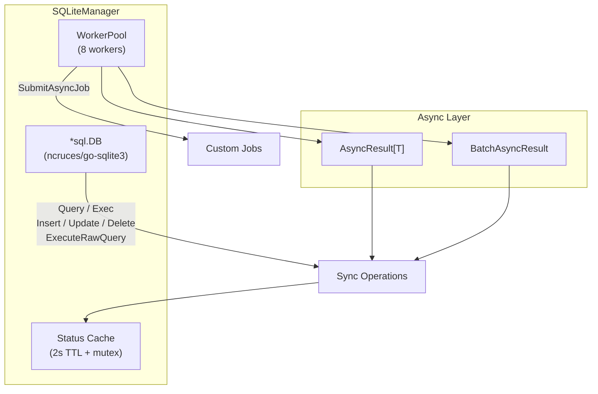

# SQLite Manager

## Overview

The `SQLiteManager` is a comprehensive Go library for embedded SQLite databases using the pure-Go `ncruces/go-sqlite3` driver (no cgo). It provides both single-file and multi-connection (multiple database files) support, a rich synchronous API, complete asynchronous wrappers, batch operations, raw result mapping, worker pool concurrency, and production-grade status/health reporting — all as a self-contained plugin that requires zero changes to the central configuration structs.

**Import Path:** `stackyrd/pkg/infrastructure`

**Driver:** `github.com/ncruces/go-sqlite3` (pure Go, modern, high performance, WAL-friendly)

## Features

- **Single & Multi-Connection**: Support for one or many SQLite files via local config parsing (no central struct pollution)
- **Full database/sql Compatibility**: `*sql.DB`, `Query`, `QueryRow`, `Exec`, `Rows`, `Result`
- **Rich Semantic API**: `Select`, `Insert`, `Update`, `Delete`, `ExecuteRawQuery` returning `[]map[string]interface{}`
- **Complete Async Support**: Every operation has an `*Async` counterpart returning `*AsyncResult[T]`
- **Batch Execution**: `ExecuteBatchAsync` for multiple queries with shared context
- **Worker Pool**: 8-worker pool for async jobs + `SubmitAsyncJob`
- **Status & Health**: TTL-cached `GetStatus()` with connection stats (Open/InUse/Idle/Wait)
- **Connection Manager**: `SQLiteConnectionManager` for named multi-db access (`GetConnection`, `GetAllConnections`, `GetDefaultConnection`)
- **Memory & File Modes**: `:memory:` or file paths (with or without `file:` URI)
- **Plugin Architecture**: 100% self-contained — configuration read exclusively via Viper, registered via `init()`
- **Graceful Disable**: Returns `nil, nil` when `sqlite.enabled=false`

## Quick Start

```go
package main

import (
	"context"
	"fmt"
	"stackyrd/pkg/infrastructure"
	"stackyrd/pkg/logger"
)

func main() {
	log := logger.NewLogger()

	// Create SQLite manager (configuration via viper under "sqlite")
	manager, err := infrastructure.NewSQLiteDB(log)
	if err != nil {
		panic(err)
	}
	if manager == nil {
		fmt.Println("SQLite disabled in config")
		return
	}
	defer manager.Close()

	ctx := context.Background()

	// Create table and insert
	_, err = manager.Exec(ctx, `
		CREATE TABLE IF NOT EXISTS users (
			id INTEGER PRIMARY KEY,
			name TEXT NOT NULL
		)`)
	if err != nil {
		panic(err)
	}

	id, err := manager.Insert(ctx, "INSERT INTO users (name) VALUES (?)", "Alice")
	if err != nil {
		panic(err)
	}
	fmt.Printf("Inserted user with ID: %d\n", id)

	// Raw query returning maps
	rows, err := manager.ExecuteRawQuery(ctx, "SELECT * FROM users")
	if err != nil {
		panic(err)
	}
	fmt.Printf("Users: %+v\n", rows)
}
```

## Architecture

### Core Structs

| Struct                      | Description                                      |
|----------------------------|--------------------------------------------------|
| `SQLiteManager`            | Main manager wrapping `*sql.DB` + worker pool   |
| `SQLiteConnectionManager`  | Multi-connection container for named DBs        |
| `sqliteConfig` (local)     | Internal single-connection config shape         |
| `sqliteMultiConfig` (local)| Internal multi-connection config shape          |

### Concurrency Model



## How It Works

### 1. Initialization Flow (Single)

```
NewSQLiteDB(l)
    │
    ├── viper.UnmarshalKey("sqlite", &sqliteConfig)
    ├── !cfg.Enabled → return nil, nil
    ├── path := cfg.Path (default ":memory:")
    ├── sql.Open("sqlite3", path)
    ├── Ping()
    ├── SetMaxOpenConns(10), SetMaxIdleConns(5)
    ├── NewWorkerPool(8).Start()
    └── Return SQLiteManager{DB, Pool}
```

### 2. Multi-Connection Initialization

```
NewSQLiteConnectionManager(l)
    │
    ├── viper.UnmarshalKey("sqlite", &sqliteMultiConfig)
    ├── !mcfg.Enabled → return nil, nil
    ├── For each enabled connection:
    │     ├── build sqliteConfig from connection entry
    │     ├── newSQLiteDBFromConfig(single)
    │     └── store in connections map[name]
    └── Return SQLiteConnectionManager
```

### 3. Query Execution Flow

```
Query(ctx, sql, args...)
    │
    └── DB.QueryContext(ctx, sql, args...)
```

### 4. Async Wrapper Flow (example: InsertAsync)

```
InsertAsync(ctx, sql, args)
    │
    └── ExecuteAsync(ctx, func() (int64, error) {
            return Insert(ctx, sql, args...)
        })
    └── Returns *AsyncResult[int64] with Ch / ErrCh
```

### 5. Batch Async Flow

```
ExecuteBatchAsync(ctx, queries, args)
    │
    ├── length check
    ├── build []AsyncOperation[sql.Result]
    └── ExecuteBatchAsync(ctx, ops, 20)
```

### 6. Status Caching Flow

```
GetStatus()
    │
    ├── statusMu + check 2s TTL cache → return cached
    ├── actual DB.Ping()
    ├── collect sql.DB.Stats()
    ├── store in cache + update expiry
    └── return fresh stats
```

## Configuration

### Viper Configuration Options (plugin style — no central struct)

| Key                        | Type   | Default     | Description                              |
|---------------------------|--------|-------------|------------------------------------------|
| `sqlite.enabled`          | bool   | false       | Enable/disable the SQLite plugin         |
| `sqlite.path`             | string | ""          | DB path (`:memory:`, `data/app.db`, `file:...?mode=rwc`) |
| `sqlite.connections`      | array  | []          | Multi-connection list (each has name, enabled, path) |

**Environment variable mapping** (automatic via Viper):
- `SQLITE_ENABLED=true`
- `SQLITE_PATH="data/prod.sqlite"`
- `SQLITE_CONNECTIONS_0_NAME=primary`
- `SQLITE_CONNECTIONS_0_PATH="data/primary.sqlite"`

### Example YAML (single)

```yaml
sqlite:
  enabled: true
  path: "data/app.sqlite"
```

### Example YAML (multi)

```yaml
sqlite:
  enabled: true
  connections:
    - name: primary
      enabled: true
      path: "data/primary.sqlite"
    - name: logs
      enabled: true
      path: "data/logs.sqlite"
```

## Usage Examples

### Basic CRUD

```go
ctx := context.Background()

manager.Exec(ctx, `CREATE TABLE IF NOT EXISTS products (id INTEGER PRIMARY KEY, name TEXT)`)
manager.Insert(ctx, "INSERT INTO products (name) VALUES (?)", "Laptop")
manager.Update(ctx, "UPDATE products SET name=? WHERE id=?", "MacBook", 1)
manager.Delete(ctx, "DELETE FROM products WHERE id=?", 1)

rows, _ := manager.Query(ctx, "SELECT * FROM products WHERE name LIKE ?", "%Book%")
defer rows.Close()
```

### Raw Query (map results)

```go
results, err := manager.ExecuteRawQuery(ctx, "SELECT id, name FROM users LIMIT 100")
for _, row := range results {
    fmt.Printf("%v: %v\n", row["id"], row["name"])
}
```

### Async Operations

```go
result := manager.InsertAsync(ctx, "INSERT ...", "Bob")
select {
case id := <-result.Ch:
    fmt.Println("Inserted:", id)
case err := <-result.ErrCh:
    fmt.Println("Error:", err)
}
```

### Batch Async

```go
queries := []string{
    "INSERT INTO events (type) VALUES (?)",
    "UPDATE stats SET count = count + 1",
}
args := [][]interface{}{{"login"}, {}}

batch := manager.ExecuteBatchAsync(ctx, queries, args)
```

### Multi-Connection Usage

```go
m, _ := infrastructure.NewSQLiteConnectionManager(log)
primary, _ := m.GetConnection("primary")
logsDB, _ := m.GetConnection("logs")

primary.Insert(ctx, "INSERT ...")
logsDB.Insert(ctx, "INSERT INTO log ...")
```

### Status & Health

```go
status := manager.GetStatus()
fmt.Println("Connected:", status["connected"])
fmt.Println("In use:", status["in_use"])
```

### Submit Custom Async Job

```go
manager.SubmitAsyncJob(func() {
    // long running work using the DB
    manager.Exec(context.Background(), "VACUUM")
})
```

## Error Handling

All methods follow standard Go error patterns. `GetStatus()` returns `connected=false` on nil receiver or failed ping.

Common errors:
- `failed to open sqlite connection`
- `failed to connect to sqlite`
- `database connection is nil`
- `queries and args length mismatch`

## Common Pitfalls

### 1. File Locking / Concurrency
SQLite has limited writer concurrency. Use WAL mode via URI:
`path: "file:data/app.sqlite?_journal_mode=WAL&_busy_timeout=5000"`

### 2. :memory: Databases
Each `sql.Open` on `:memory:` creates a **new** isolated DB. For shared in-memory use the shared cache URI.

### 3. Connection Pool Settings
The manager sets conservative defaults (MaxOpen=10). For heavy read workloads you may increase via the underlying `*sql.DB` if needed.

### 4. Multi-Connection Paths
Paths in the `connections` array are resolved relative to the working directory of the process.

### 5. Plugin Not Appearing
Ensure the file is compiled in (it is via package import of `infrastructure`). Check `viper.GetBool("sqlite.enabled")`.

## Advanced Usage

### Transactions (manual)

```go
tx, _ := manager.DB.BeginTx(ctx, nil)
defer tx.Rollback()
tx.ExecContext(...) 
tx.Commit()
```

### Using the Raw *sql.DB

```go
db := manager.DB   // full access to *sql.DB
```

### Custom Pragmas at Open Time

Pass them in the path:
`path: "file:data/app.sqlite?_pragma=foreign_keys(1)&_pragma=journal_mode(WAL)"`

## Internal Algorithms

(See "How It Works" section above for the numbered flows.)

## Dependencies

| Dependency                          | Role                              |
|-------------------------------------|-----------------------------------|
| `github.com/ncruces/go-sqlite3`     | Pure-Go SQLite driver (stdlib compatible) |
| `github.com/spf13/viper`            | Configuration (plugin style)      |
| `stackyrd/pkg/logger`               | Structured logging                |
| `stackyrd/pkg/infrastructure` (internal) | WorkerPool, AsyncResult, registry |
| Standard library                    | `database/sql`, `context`, `sync`, `time`, `fmt` |

## License

This code is part of the Stackyrd project. See the main project LICENSE file for details.
