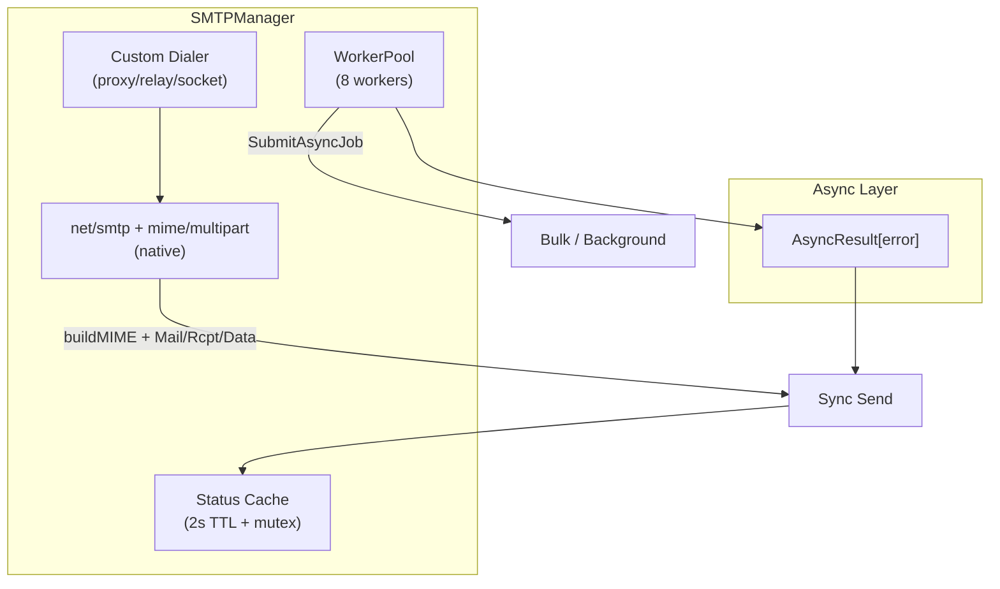
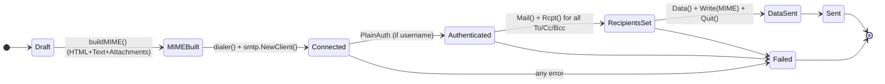

# SMTP Manager

## Overview

The `SMTPManager` is a fully native (stdlib-only) rich email delivery component using Go's `net/smtp` and `mime/multipart`. It provides flexible sending of plain text, HTML, multiple attachments, multiple recipients (To/Cc/Bcc), custom headers, STARTTLS/SMTPS, custom dialers for relays/proxies/sockets, complete async support, worker pool, and one-call GIN endpoint integration — all as a self-contained plugin with zero external dependencies beyond the standard library.

**Import Path:** `stackyrd/pkg/infrastructure`

**Driver:** `net/smtp` + `mime/multipart` (pure stdlib, no 3rd party email libraries)

## Features

- **Native Implementation**: Zero external email packages — everything built with `net/smtp`, `mime`, `multipart`, `base64`, `quotedprintable`
- **Rich Content**: Plain text + HTML (multipart/alternative), multiple attachments with correct MIME types
- **Multiple Recipients**: Full support for To, Cc, Bcc (Bcc excluded from headers)
- **Flexible Sending**: `Send`, `SendSimple`, `SendHTML`, `SendWithAttachments`, and fully typed `EmailMessage`
- **Custom Dialer Support**: Inject any `net.Conn` dialer for SOCKS proxies, custom relays, Unix sockets, or connection pooling
- **TLS & Auth**: STARTTLS, implicit TLS (465), PlainAuth, configurable timeouts and LocalName (EHLO)
- **Async & Concurrency**: Every send has `*Async` variant + 8-worker pool + `SubmitAsyncJob`
- **GIN One-Call Integration**: `SendEmailHandler()` and `SendEmailFormHandler()` (with multipart file uploads) — mount in one line
- **Status & Health**: TTL-cached `GetStatus()` with live connectivity test
- **Plugin Architecture**: 100% self-contained, Viper-only config, `init()` auto-register
- **Graceful Disable**: Returns `nil, nil` when `smtp.enabled=false`

## Quick Start

```go
package main

import (
	"fmt"
	"stackyrd/pkg/infrastructure"
	"stackyrd/pkg/logger"
)

func main() {
	log := logger.NewLogger()

	smtp, err := infrastructure.NewSMTPManager(log)
	if err != nil {
		panic(err)
	}
	if smtp == nil {
		fmt.Println("SMTP disabled in config")
		return
	}
	defer smtp.Close()

	// Simple send
	err = smtp.SendSimple([]string{"user@example.com"}, "Hello", "Plain text body")
	if err != nil {
		panic(err)
	}

	// Rich HTML + attachments
	msg := infrastructure.EmailMessage{
		To:       []string{"user@example.com"},
		Cc:       []string{"team@example.com"},
		Subject:  "Invoice",
		HTMLBody: "<h1>Thanks</h1><p>See attachment</p>",
		TextBody: "Thanks\nSee attachment",
		Attachments: []infrastructure.Attachment{{
			Filename: "invoice.pdf",
			Data:     pdfBytes,
		}},
	}
	smtp.Send(msg)
}
```

## Architecture

### Core Structs

| Struct                      | Description                                      |
|----------------------------|--------------------------------------------------|
| `SMTPManager`              | Main manager with config, dialer, worker pool   |
| `EmailMessage`             | Rich email DTO (To/Cc/Bcc, HTML+Text, Attachments, Headers) |
| `Attachment`               | File attachment with name, content-type, data   |
| `smtpConfig` (local)       | Internal Viper-parsed configuration             |

### Concurrency Model



### State Diagram (Email Lifecycle)



## How It Works

### 1. Initialization Flow

```
NewSMTPManager(l)
    │
    ├── viper.UnmarshalKey("smtp", &smtpConfig)
    ├── !cfg.Enabled → return nil, nil
    ├── apply defaults (port=587, timeout=30, local_name=localhost)
    ├── NewWorkerPool(8).Start()
    ├── dialer = net.Dialer with timeout
    └── Return SMTPManager{cfg, dialer, Pool}
```

### 2. Message Building Flow (Native MIME)

```
buildMIME(msg)
    │
    ├── set From/To/Cc/Subject/Date/MIME headers (quoted-printable)
    ├── multipart/mixed
    │     ├── multipart/alternative (if both text+html)
    │     │     ├── text/plain (quoted-printable)
    │     │     └── text/html (quoted-printable)
    │     └── application/octet-stream for each attachment (base64)
    └── return complete RFC 5322 bytes
```

### 3. Send Execution Flow

```
Send(msg)
    │
    ├── dialer("tcp", host:port)
    ├── smtp.NewClient(conn, host)
    ├── Hello(localName)
    ├── StartTLS (if configured)
    ├── Auth(PlainAuth)
    ├── Mail(From) + Rcpt() for every recipient
    ├── Data() + Write(buildMIME) + Close + Quit
    └── return error or nil
```

### 4. Async Wrapper Flow

```
SendAsync(msg)
    │
    └── ExecuteAsync(ctx, func() error { return Send(msg) })
```

### 5. GIN Handler Flow (One-Call Integration)

```
SendEmailHandler()
    │
    ├── c.ShouldBindJSON(&EmailMessage)
    ├── manager.Send(msg)
    └── c.JSON(200, {"sent":true})
```

### 6. Status Caching Flow

```
GetStatus()
    │
    ├── statusMu + 2s TTL → cached
    ├── dialer test + collect cfg
    ├── store + expiry
    └── return
```

## Configuration

### Viper Configuration Options (plugin style — no central struct)

| Key                        | Type   | Default     | Description                                      |
|----------------------------|--------|-------------|--------------------------------------------------|
| `smtp.enabled`             | bool   | false       | Enable/disable the SMTP plugin                   |
| `smtp.host`                | string | ""          | SMTP server hostname or IP                       |
| `smtp.port`                | int    | 587         | Port (25, 587 STARTTLS, 465 SMTPS)               |
| `smtp.username`            | string | ""          | Auth username (PLAIN)                            |
| `smtp.password`            | string | ""          | Auth password                                    |
| `smtp.from`                | string | ""          | Default From address                             |
| `smtp.from_name`           | string | ""          | Default From display name                        |
| `smtp.reply_to`            | string | ""          | Default Reply-To                                 |
| `smtp.use_tls`             | bool   | false       | Use implicit TLS (usually port 465)              |
| `smtp.use_starttls`        | bool   | false       | Use STARTTLS (usually port 587)                  |
| `smtp.skip_verify`         | bool   | false       | Skip TLS certificate verification (dev only)     |
| `smtp.local_name`          | string | "localhost" | HELO/EHLO name                                   |
| `smtp.timeout`             | int    | 30          | Dial and operation timeout in seconds            |

**Environment variable mapping**:
- `SMTP_ENABLED=true`
- `SMTP_HOST="smtp.gmail.com"`
- `SMTP_PORT=587`
- `SMTP_USERNAME="user"`
- `SMTP_PASSWORD="secret"`
- `SMTP_FROM="noreply@company.com"`
- `SMTP_USE_STARTTLS=true`

### Example YAML

```yaml
smtp:
  enabled: true
  host: "smtp.example.com"
  port: 587
  username: "apikey"
  password: "secret"
  from: "noreply@company.com"
  from_name: "Company"
  use_starttls: true
  timeout: 15
  local_name: "mail.company.com"
```

## Usage Examples

### Basic & Rich Sends

```go
smtp.SendSimple([]string{"a@b.com"}, "Hi", "body")

msg := infrastructure.EmailMessage{
    To: []string{"a@b.com", "c@d.com"},
    Cc: []string{"team@company.com"},
    Bcc: []string{"audit@company.com"},
    Subject: "Report",
    HTMLBody: "<b>Hello</b>",
    TextBody: "Hello",
    Attachments: []infrastructure.Attachment{{
        Filename: "report.pdf",
        ContentType: "application/pdf",
        Data: pdfData,
    }},
}
smtp.Send(msg)
```

### GIN One-Call Endpoint Integration

```go
// In any router/service — literally one line
r.POST("/email/send", smtpManager.SendEmailHandler())

// Form version with file uploads (multipart)
r.POST("/email/send-form", smtpManager.SendEmailFormHandler())
```

JSON body example for `/email/send`:
```json
{
  "to": ["user@example.com"],
  "cc": ["boss@example.com"],
  "subject": "Hello",
  "html_body": "<h1>Hi</h1>",
  "text_body": "Hi",
  "attachments": []
}
```

Direct `` or form upload also supported via the form handler.

### Async & Batch

```go
result := smtp.SendAsync(msg)
err := result.Wait()

smtp.SubmitAsyncJob(func() {
    smtp.Send(largeBatch...)
})
```

### Custom Dialer (Proxy / Relay / Socket)

```go
// Example: inject SOCKS5 dialer from golang.org/x/net/proxy (in your app code only)
dialer, _ := proxy.SOCKS5("tcp", "127.0.0.1:1080", nil, proxy.Direct)
smtp.SetCustomDialer(dialer.Dial)
```

### Status

```go
status := smtp.GetStatus()
fmt.Println("Connected:", status["connected"])
```

## Error Handling

All send methods return standard Go errors.

Common errors:
- `dial failed`
- `smtp client`
- `auth`
- `starttls`
- `550 5.1.1 User unknown` (from remote)

## Common Pitfalls

### 1. Port & TLS Mismatch
Port 465 usually needs `use_tls: true`. Port 587 needs `use_starttls: true`.

### 2. From Address
Many relays require the From address to match the authenticated user or be in an allowed domain.

### 3. Large Attachments
The current implementation loads entire attachments in memory. For >10MB files consider streaming or chunked approach.

### 4. Bcc Visibility
Bcc recipients are only sent via RCPT TO — they never appear in headers. This is correct behavior.

### 5. Custom Dialer Lifetime
`SetCustomDialer` affects all future sends. Do not change it concurrently without synchronization.

### 6. Rate Limiting
Many providers rate-limit. Use the worker pool size and timeouts wisely.

## Advanced Usage

### Custom Headers & Reply-To Per Message

```go
msg.Headers = map[string]string{
    "X-Mailer": "Stackyrd/1.0",
    "List-Unsubscribe": "<mailto:unsub@company.com>",
}
```

### Injecting Custom Dialer for Any Transport

The `SetCustomDialer` allows complete control (SOCKS, HTTP CONNECT proxy, Unix socket to a local relay, connection multiplexing, etc.) without any dependency in the plugin.

### Using with Existing net.Conn

You can wrap any `net.Conn` (TLS, proxied, etc.) by providing a dialer that returns it.

## Internal Algorithms

(See the numbered flows in "How It Works" and the State Diagram above.)

## Dependencies

| Dependency                          | Role                                      |
|-------------------------------------|-------------------------------------------|
| `net/smtp` (stdlib)                 | Core SMTP client (Mail/Rcpt/Data)         |
| `mime/multipart`, `mime`, `quotedprintable` (stdlib) | Full RFC-compliant MIME construction |
| `encoding/base64` (stdlib)          | Attachment & body encoding                |
| `crypto/tls` + `net` (stdlib)       | TLS / STARTTLS / custom dialing           |
| `github.com/gin-gonic/gin`          | Optional rich HTTP handlers (already in project) |
| `github.com/spf13/viper`            | Configuration (plugin style)              |
| `stackyrd/pkg/logger`               | Structured logging                        |
| `stackyrd/pkg/infrastructure` (internal) | WorkerPool, AsyncResult, registry     |

## License

This code is part of the Stackyrd project. See the main project LICENSE file for details.
